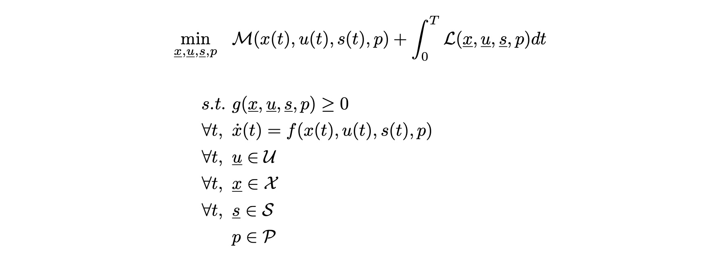

<p align="center">
    
</p>

`Bioptim` is an optimal control program (OCP) framework for biomechanics. 
It is based on the efficient [biorbd](https://github.com/pyomeca/biorbd) biomechanics library and benefits from the powerful algorithmic diff provided by [CasADi](https://web.casadi.org/).
It interfaces the robust [`Ipopt`](https://github.com/coin-or/Ipopt) and the fast [`Acados`](https://github.com/acados/acados) solvers to suit all your needs for solving OCP in biomechanics. 

## Status

| Type | Status |
|---|---|
| License | <a href="https://opensource.org/licenses/MIT"></a> |
| Continuous integration | [](https://github.com/pyomeca/bioptim/actions) |
| Code coverage | [](https://codecov.io/gh/pyomeca/bioptim) |
| DOI | [](https://zenodo.org/badge/latestdoi/251615517) |
| Publication | [](https://ieeexplore.ieee.org/document/9808374) |

The current status of `bioptim` on conda-forge is

| Name | Downloads | Version | Platforms | MyBinder |
| --- | --- | --- | --- | --- |
| [](https://anaconda.org/conda-forge/bioptim) | [](https://anaconda.org/conda-forge/bioptim) | [](https://anaconda.org/conda-forge/bioptim) | [](https://anaconda.org/conda-forge/bioptim) | [](https://mybinder.org/v2/gh/pyomeca/bioptim-tutorial/HEAD?urlpath=lab) |


## Contact
You can join us on Discord 
[](https://discord.gg/Ux7BkdjQFW)
or open an Issue on GitHub.
We would be thrilled to discuss with you about `bioptim` and biomechanics/optimal control in general!


# Try bioptim

Anyone can play with bioptim with a working (but slightly limited in terms of graphics) MyBinder by clicking the following badge

[](https://mybinder.org/v2/gh/pyomeca/bioptim-tutorial/HEAD?urlpath=lab)

As a tour guide that uses this binder, you can watch the `bioptim` workshop that we gave at the CMBBE conference on September 2021 by following this link:
[https://youtu.be/z7fhKoW1y60](https://youtu.be/z7fhKoW1y60)

A GUI is available to run all the current examples. To run it you can use the following command, from the root folder of the project:
```bash
conda install -c conda-forge pyqt pyqtgraph
python -m bioptim.examples
```
Please refer to section [Examples](#examples) for more information on how to run the examples.

# Table of Contents 


[Testing bioptim](#try-bioptim)
<details>
<summary><a href="#how-to-install">How to install</a></summary>

- [From anaconda](#installing-from-anaconda-for-windows-linux-and-mac)
- [From the sources](#installing-from-the-sources-for-linux-mac-and-windows)
- [Installation complete](#installation-complete)

</details>


[Defining our optimal control problems](#defining-our-optimal-control-problems)

<details>
<summary><a href="#a-first-practical-example">A first practical example</a></summary>

- [The import](#the-import)
- [Building the ocp](#building-the-ocp)
- [Solving the ocp](#solving-the-ocp)
- [Show the results](#show-the-results)
- [The full example files](#the-complete-example-files)
- [Solving using multi-start](#solving-using-multi-start)

</details>


<details>
  <summary><a href="#a-more-in-depth-look-at-the-bioptim-api">A more in depth look at the `bioptim` API</a></summary>

  - <details>
    <summary><a href="#the-ocp">The OCP</a></summary>
  
    - [OptimalControlProgram](#class-optimalcontrolprogram)
    - [NonLinearProgram](#class-nonlinearprogram)
    - [VariationalOptimalControlProgram](#class-variationaloptimalcontrolprogram)
    - [PlottingServer](#class-plottingserver)

    </details>

  - <details>
    <summary><a href="#the-dynamics">The dynamics</a></summary>

    - [DynamicsOptions](#class-dynamicsoptions)
    - [DynamicsOptionsList](#class-dynamicsoptionslist)

    </details>

  - <details>
    <summary><a href="#the-bounds">The bounds</a></summary>

    - [Bounds](#the-bounds)
    - [BoundsList](#class-boundslist)

    </details>

  - <details>
    <summary><a href="#the-initial-conditions">The initial conditions</a></summary>

    - [InitialGuess](#the-initial-conditions)
    - [InitialGuessList](#class-initialguesslist)

    </details>

  - <details>
    <summary><a href="#the-variable-scaling">The variable scaling</a></summary>

    - [VariableScaling](#the-variable-scaling)
    - [VariableScalingList](#class-variablescalinglist)

    </details>

  - <details>
    <summary><a href="#the-constraints">The constraints</a></summary>

    - [Constraint](#class-constraint)
    - [ConstraintList](#class-constraintlist)
    - [ConstraintFcn](#class-constraintfcn)

    </details>

  - <details>
    <summary><a href="#the-objective-functions">The objective functions</a></summary>

    - [Objective](#class-objective)
    - [ObjectiveList](#class-objectivelist)
    - [ObjectiveFcn](#class-objectivefcn)

    </details>

  - <details>
    <summary><a href="#the-parameters">The parameters</a></summary>

    - [ParameterList](#class-parameterlist)

    </details>

  - <details>
    <summary><a href="#the-multinode-constraints">The multinode constraints</a></summary>

    - [MultinodeConstraintList](#class-multinodeconstraintlist)
    - [MultinodeConstraintFcn](#class-multinodeconstraintfcn)

    </details>

  - <details>
    <summary><a href="#the-phase-transitions">The phase transitions</a></summary>

    - [PhaseTransitionList](#class-phasetransitionlist)
    - [PhaseTransitionFcn](#class-phasetransitionfcn)

    </details>

  - <details>
    <summary><a href="#the-results">The results</a></summary>

    - [Data manipulation](#data-manipulation)
    - [Data visualization](#data-visualization)

    </details>

  - <details>
    <summary><a href="#the-extra-stuff-and-the-enum">The extra stuff and the Enum</a></summary>

    - [The mappings](#the-mappings)
    - [Weight](#weight)
    - [Node](#enum-node)
    - [OdeSolver](#class-odesolver)
    - [Solver](#enum-solver)
    - [ControlType](#enum-controltype)
    - [PlotType](#enum-plottype)
    - [OnlineOptim](#enum-onlineoptim)
    - [InterpolationType](#enum-interpolationtype)
    - [Shooting](#enum-shooting)
    - [CostType](#enum-costtype)
    - [SolutionIntegrator](#enum-solutionintegrator)
    - [QuadratureRule](#enum-quadraturerule)
    - [DefectType](#enum-defecttype)

    </details>

  </details>


        
<details>
<summary><a href="#examples">Examples</a></summary>

- [Run examples](#run-examples)
- [Getting started](#getting-started)
- [Muscle driven OCP](#muscle-driven-ocp)
- [Muscle driven with contact](#muscle-driven-with-contact)
- [Optimal time OCP](#optimal-time-ocp)
- [Symmetrical torque driven OCP](#symmetrical-torque-driven-ocp)
- [Torque driven OCP](#torque-driven-ocp)
- [Tracking](#tracking)
- [Moving estimation horizon](#moving-estimation-horizon-mhe)
- [Acados](#acados)
- [Inverse optimal control](#inverse-optimal-control)
- [Discrete mechanics and optimal control](#discrete-mechanics-and-optimal-control)
- [Fatigue](#fatigue)
- [Holonomic constraints](#holonomic-constraints)
- [SQP method](#sqp-method)
- [Stochastic optimal control](#stochastic-optimal-control)
- [Multi-start](#multi-start)
- [Biomechanics](#biomechanics)

</details>


<details>
<summary><a href="#performance">Performance</a></summary>

- [use_sx](#use_sx)
- [n_threads](#n_threads)
- [expand](#expand)

</details>


<details>
<summary><a href="#troubleshooting">Troubleshooting</a></summary>

- [freezing compute](#freezing-compute)
- [free variables](#free-variables)
- [non-converging problem](#non-converging-problems)

</details>


[Citing](#citing)


# How to install 
The preferred way to install for the lay user is using anaconda. 
Another way, more designed for the core programmers, is from the sources. 
`bioptim` requires Python 3.10 or newer.
It is tested on Linux, macOS and Windows (see the continuous integration workflows).
Note that the `Acados` solver is not provided as a package and must be installed separately on all platforms (see below).

## Installing from Anaconda (For Windows, Linux, and Mac)
The easiest way to install `bioptim` is to download the binaries from [Anaconda](https://anaconda.org/) repositories. 
The project is hosted on the conda-forge channel (https://anaconda.org/conda-forge/bioptim).

After having appropriately installed an anaconda client [my suggestion would be Miniconda (https://conda.io/miniconda.html)] and loaded the desired environment to install `bioptim` in, just type the following command:
```bash
conda install -c conda-forge bioptim
```
This will download and install all the dependencies and install `bioptim`. 
And that is it! 
You can already enjoy using bioptim!

## Installing from the sources (For Linux, Mac, and Windows)
Installing from the sources is as easy as installing from Anaconda, with the difference that you will be required to download and install the dependencies by hand (see the section below). 

### Dependencies
`bioptim` relies on several libraries. 
The most obvious one is the `biorbd` suite (including indeed `biorbd` and `bioviz`), but extra libraries are required.
Due to the different dependencies, it would be tedious to show how to install them all here. 
The user is therefore invited to read the relevant documentation. 

Here is a list of all direct dependencies (meaning that some dependencies may require other libraries themselves):  
[Python](https://www.python.org/) | [numpy](https://numpy.org/) | [scipy](https://scipy.org/) | [packaging](https://packaging.python.org/) | [setuptools](https://pypi.org/project/setuptools/)
| [matplotlib](https://matplotlib.org/) | [pandas](https://pandas.pydata.org/) | [pyomeca](https://github.com/pyomeca/pyomeca) | [CasADi](https://web.casadi.org/) | [biorbd](https://github.com/pyomeca/biorbd) (versions >=1.12 and <1.13 are used by the `environment.yml` file) | [pinocchio](https://github.com/stack-of-tasks/pinocchio) (optional, alternative to `biorbd` for some models) | [vtk](https://vtk.org/) | [PyQt](https://www.riverbankcomputing.com/software/pyqt) | [bioviz](https://github.com/pyomeca/bioviz) | [graphviz](https://graphviz.org/) | [`Ipopt`](https://github.com/coin-or/Ipopt) | [`Acados`](https://github.com/acados/acados) | [pyqtgraph](https://www.pyqtgraph.org/) | [pygmo](https://esa.github.io/pygmo2/) (only for the inverse optimal control example)  
and optionally: [The linear solvers from the HSL Mathematical Software Library](http://www.hsl.rl.ac.uk/index.html) with install instructions [here](https://github.com/casadi/casadi/wiki/Obtaining-HSL).

#### Linux - Installing dependencies with conda
All these (except for ̀`Acados` and the HSL lib) can easily be installed using (assuming the anaconda3 environment is loaded if needed) the `pip3` command or the Anaconda's following command:
```bash
conda install biorbd bioviz python-graphviz -cconda-forge
```
Since there is no `Anaconda` nor `pip3` package of `Acados`, a convenient installer is provided with `bioptim`. 
The installer can be found and run at `[ROOT_BIOPTIM]/external/acados_install_linux.sh`.
However, the installer requires an `Anaconda3` environment.
If you have an `Anaconda3` environment loaded, the installer should find itself where to install it. 
If you want to install it elsewhere, you can provide the script with a first argument which is the `$CONDA_PREFIX`. 
The second argument that can be passed to the script is the `$BLASFEO_TARGET`. 
If you don't know what it is, it is probably better to keep the default. 
Please note that depending on your computer architecture, `Acados` may or may not work correctly.

#### Mac - Installing dependencies with conda
Equivalently for MacOSX:
```bash
conda install casadi 'biorbd' 'bioviz' python-graphviz -cconda-forge
```
Since there is no `Anaconda` nor `pip3` package of `Acados`, a convenient installer is provided with `bioptim`.
The `Acados` installation script is `[ROOT_BIOPTIM]/external/acados_install_mac.sh`.
However, the installer requires an `Anaconda3` environment.
If you have an `Anaconda3` environment loaded, the installer should find itself where to install it. 
If you want to install it elsewhere, you can provide the script with a first argument, the `$CONDA_PREFIX`. 
The second argument that can be passed to the script is the `$BLASFEO_TARGET`. 
If you don't know what it is, it is probably better to keep the default. 
Please note that depending on your computer architecture, `Acados` may or may not work correctly.

#### Windows - Installing dependencies with conda
Equivalently for Windows:
```bash
conda install casadi 'biorbd' 'bioviz' python-graphviz -cconda-forge
```
There is no `Anaconda` nor `pip3` package of `Acados`.
To use the `Acados` solver on Windows, one must compile it themselves.

#### The case of HSL solvers
HSL is a collection of state-of-the-art packages for large-scale scientific computation. 
Among its best-known packages are those for the solution of sparse linear systems (`ma27`, `ma57`, etc.), compatible with ̀`Ipopt`.
HSL packages are [available](http://www.hsl.rl.ac.uk/download/coinhsl-archive-linux-x86_64/2014.01.17/) at no cost for academic research and teaching. 
Once you obtain the HSL dynamic library (precompiled `libhsl.so` for Linux, to be compiled `libhsl.dylib` for MacOSX, `libhsl.dll` for Windows), you just have to place it in your `Anaconda3` environment into the `lib/` folder.
You can now use all the options of `bioptim`, including the HSL linear solvers with `Ipopt`.
We recommend using `ma57` as a default linear solver by calling as such:
```python
solver = Solver.IPOPT()
solver.set_linear_solver("ma57")
ocp.solve(solver)
```
## Installation complete
Once `bioptim` is downloaded, navigate to the root folder and (assuming your conda environment is loaded if needed), you can type the following command:
```bash 
pip install -e .
```
Alternatively, a complete development environment (named `bioptim`) can be created with `conda env create -f environment.yml`.
If you plan to contribute, please have a look at [docs/contributing.md](./docs/contributing.md).
Assuming everything went well, that is it! 
You can already enjoy bioptimizing!

# Defining our optimal control problems
Here we will detail our implementation of optimal control problems and some definitions.
The mathematical transcription of the OCP is as follows:

The optimization variables are the states (x = variables that represent the state of the system at each node and that 
are subject to continuity constraints), controls (u = decision variables defined at each node that drive the system),
algebraic states (s = optimization variables that are defined at each node but that are not subject to the 
built-in continuity constraints), and parameters (p = optimization variables defined once per phase).
The state continuity constraints implementation may vary depending on the transcription of the problem (implicit vs explicit, direct multiple shooting vs direct collocations).

The cost function can include Mayer terms (function evaluated at one node, the default is the last node) and Lagrange terms (functions integrated over the duration of the phase).
The Lagrange terms are computed by default as EulerForward Integrals:
```python
L = 0
for i in range(n_shooting):
  L += weight * sum((evaluated_cost[:, i] - target_cost[:, i])**2 * dt)
```
Where `weight` is by default 1 and `target_cost` is by default 0.
For mor details on the weighting of objectives and constraints, see the section [Weight](#weight) 
For more advanced approximations, see [QuadratureRule](#enum-quadraturerule) section. They can be used to evaluate more accurately the Lagrange terms of the cost function.
The optimization variables can be subject to equality and/or inequality constraints.

# A first practical example
The easiest way to learn `bioptim` is to dive into it.
So let us do that and build our first optimal control program together.
Please note that this tutorial is designed to recreate the `bioptim/examples/getting_started/basic_ocp.py` file where a pendulum is asked to start in a downward position and end, balanced, in an upward position while only being able to move sideways actively.

## The import
We will not spend time explaining the import since every one of them will be explained in detail later, and it is pretty straightforward anyway.
```python
from bioptim import (
  TorqueBiorbdModel,
  OptimalControlProgram,
  BoundsList,
  InitialGuessList,
  ObjectiveFcn,
  Objective,
  VariableScalingList,
  Solver,
  CostType,
)
```

## Building the ocp
First of all, let us load a bioMod file using `biorbd`:
```python
bio_model = TorqueBiorbdModel("pendulum.bioMod")
```
It is convenient since it will provide interesting functions such as the number of degrees of freedom (`bio_model.nb_q`).
Please note that a `pendulum.bioMod` copy is available at the end of the *Getting started* section.
In brief, the pendulum consists of two degrees of freedom (sideways movement and rotation), with the center of mass near the head.
There are different dynamics available (Torque, Muscle, TorqueDerivative, ...). Here, the dynamics of the pendulum is driven with generalized forces since a `TorqueBiorbdModel` was defined, as for many biomechanical dynamics. 
Generalized forces are forces or moments directly applied to the degrees of freedom as if virtual motors were driven them.
In `bioptim`, this dynamic is called torque driven. 
In a torque driven dynamics, the states are the positions (also called generalized coordinates, *q*) and the velocities (also called the generalized velocities, *qdot*), whereas the controls are the joint torques (also called generalized forces, *tau*).

The pendulum is required to start in a downward position (0 rad) and to finish in an upward position (3.14 rad) with no velocity at the start and end nodes.
To define that, it would be nice first to define boundary constraints on the position (*q*) and velocities (*qdot*) that match those in the bioMod file and to apply them at the very beginning, the very end, and all the intermediate nodes as well.
In this case, the state with index 0 is translation y, and index 1 refers to rotation about x. 
Finally, the index 2 and 3 are  the velocity of translation y and rotation about x,respectively.

bounds_from_ranges uses the ranges from a biorbd model and returns a structure with the minimal and maximal bounds for all the degrees of freedom and velocities on three columns corresponding to the starting, intermediate, and final nodes, respectively.
How convenient!
```python
x_bounds = BoundsList()
x_bounds["q"] = bio_model.bounds_from_ranges("q")
x_bounds["qdot"] = bio_model.bounds_from_ranges("qdot")
```
The first dimension of x_bounds is the degrees of freedom (*q*) `and` their velocities (*qdot*) that match those `in` the bioMod `file`. The time `is` discretized `in` nodes which `is` the second dimension declared `in` x_bounds.
If you have more than one phase, we would have x_bound[*phase*][*q `and` qdot*, *nodes*]
In the first place, we want the first `and` last column (which `is` equivalent to nodes 0 `and` -1) to be 0, i.e., the translations `and` rotations to be null `for` both the position `and` so the velocities.
```python
x_bounds["q"][:, [0, -1]] = 0
x_bounds["qdot"][:, [0, -1]] = 0
```
Finally, override once again the final node for the rotation so it is upside down.
```python
x_bounds["q"][1, -1] = 3.14
```
At that point, you may want to have a look at the `x_bounds["q"].min` and `x_bounds["q"].max` matrices to convince yourself that the initial and final positions are prescribed and that all the intermediate points are free up to certain minimal and maximal values. 

Up to that point, nothing prevents the solver from simply using the virtual motor of the rotation to rotate the pendulum upward (like clock hands) to get to the upside-down rotation. 
What makes this example interesting is that we can prevent this by defining minimal and maximal bounds on the control (the maximal forces that these motors have)
```
u_bounds = BoundsList()
u_bounds["tau"] = [-100, 0], [100, 0]
```
Like this, the sideways force ranges from -100 Newton to 100 Newton, but the rotation force ranges from 0 N/m to 0 N/m.
Again, `u_bounds` is defined for the first, the intermediate, and the final nodes, but this time, we do not want to specify anything particular for the first and final nodes, so we can leave them as is. 

If you are wondering where are defined *q*, *qdot* and *tau*, it is in the configuration of the `TorqueBiorbdModel`, more specifically in the `TorqueDynamics`. If you define a custom model with a custom dynamics, then the variable's name should match those you define yourself.

Who says optimization says cost function.
Even though, it is possible to define an OCP without objective, it is not so much recommended, and let us face it... much less fun!
So the pendulum's goal (or the cost function) is to perform its task while using the minimum forces possible. 
Therefore, an objective function that minimizes the generalized forces (the control named `tau`) is defined:
```python
objective_functions = Objective(ObjectiveFcn.Lagrange.MINIMIZE_CONTROL, key="tau")
```

At that point, it is possible to solve the program.
Still, helping the solver is usually a good idea, so let us give ̀`Ipopt` a starting point to investigate.
The initial guess that we can provide is those for the states (`x_init`, here *q* and *qdot*) and for the controls (`u_init`, here *tau*). 
So let us define both of them quickly
```python
x_init = InitialGuessList()
x_init["q"] = [0, 0]
x_init["qdot"] = [0, 0]

u_init = InitialGuessList()
u_init["tau"] = [0, 0]
```
Please note that initial guess is optional. The default value if a value is not provided is zero.

On the same train of thought, if we want to help the solver even more, we can also define a variable scaling for the states (`x_scaling`, here *q* and *qdot*) and for the controls (`u_scaling`, here *tau*). *Note that the scaling should be declared in the order in which the variables appear. 
We encourage you to choose a variable scaling the same order of magnitude to the expected optimal values.
```python
x_scaling = VariableScalingList()
x_scaling.add("q", scaling=[1, 3])
x_scaling.add("qdot", scaling=[85, 85])
   
u_scaling = VariableScalingList()
u_scaling.add("tau", scaling=[900, 1])
```
We now have everything to create the ocp!
For that, we have to decide how much time the pendulum has to get up there (`phase_time`) and how many shooting points are defined for the multishoot (`n_shooting`).
Thereafter, you have to send everything to the `OptimalControlProgram` class and let `bioptim` prepare everything for you.
For simplicity's sake, I copied all the pieces of code previously visited in the building of the ocp section here:
```python
ocp = OptimalControlProgram(
        bio_model,
        n_shooting=25,
        phase_time=3,
        x_bounds=x_bounds,
        u_bounds=u_bounds,
        x_init=x_init,
        u_init=u_init,
        objective_functions=objective_functions,
        x_scaling=x_scaling,
        u_scaling=u_scaling,
    )
```


## Checking the ocp
Now you can check if the ocp is well-defined for the initial values.
This checking will help see if your constraints and objectives are okay.
To visualize it, you can use
```python
ocp.check_conditioning()
```
This call will print two different plots!

The first shows the Jacobian matrix of constraints and the norm of each Hessian matrix of constraints.
There is one matrix for each phase.
The first half of the plot can be used to verify if some constraints are redundant. It simply compares the rank of the Jacobian with the number of constraints for each phase.
The second half of the plot can be used to verify if the equality constraints are linear.

The second plot window shows the hessian of the objective for each phase. It calculates if the problem can be convex by checking if the matrix is positive semi-definite.
It also calculates the condition number for each phase thanks to the eigenvalues.

If everything is okay, let us solve the ocp !

## Solving the ocp
It is now time to see `Ipopt` in action! 
To solve the ocp, you simply have to call the `solve()` method of the `ocp` class
```python
solver = Solver.IPOPT(show_online_optim=True)
sol = ocp.solve(solver)
```
If you feel fancy, you can even activate the online optimization graphs!
However, for such an easy problem, `Ipopt` will not leave you the time to appreciate the real-time updates of the graph...
For a more complicated problem, you may also wish to visualize the objectives and constraints during the optimization 
(useful when debugging, because who codes the right thing the first time). You can do it by calling
```python
ocp.add_plot_penalty(CostType.OBJECTIVES)
ocp.add_plot_penalty(CostType.CONSTRAINTS)
```
or alternatively asks for both at once using
```python
ocp.add_plot_penalty(CostType.ALL)
```
That's it!

## Show the results
If you want to look at the animated data, `bioptim` has an interface to `bioviz` designed to visualize bioMod files.
For that, simply call the `animate()` method of the solution:
```python
sol.animate()
```

If you did not fancy the online graphs but would enjoy them anyway, you can call the method `graphs()`:
```python
sol.graphs()
```

If you are interested in the results of individual objective functions and constraints, you can print them using the 
`print_cost()` or access them using the `detailed_cost_values()`:

```python
# sol.detailed_cost  # Invoke this for adding the details of the objectives to sol for later manipulations
sol.print_cost()  # For printing their values in the console
```

And that is all! 
You have completed your first optimal control program with `bioptim`! 

## Solving using multi-start
Due to the gradient descent methods, we can affirm that the optimal solution is a local minimum. However, it is impossible to know if a global minimum was found. For highly non-linear problems, there might exist a wide range of local 
optima. Solving the same problem with different initial guesses can be helpful to find the best local minimum or to 
compare the different optimal kinematics. It is possible to multi-start the problem by creating a multi-start object 
with `MultiStart()` and running it with its method `run()`.
An example of how to use multi-start is given in [bioptim/examples/getting_started/example_multistart.py](./bioptim/examples/getting_started/example_multistart.py).

## Solving stochastic optimal control problems (SOCP)
It is possible to solve SOCP (also called optimal feedback control problem) using the class 
`StochasticOptimalControlProgram`. You just have to add the type of SOCP that you want to solve using
`SocpType.COLLOCATION(motor_noise_magnitude, sensory_noise_magnitude)`. 
Our implementation of SOCP is based on Van Wouwe 2022 (https://doi.org/10.1371/journal.pcbi.1009338). 
In the examples folder bioptim/examples/toy_examples/stochastic_optimal_control, you will find arm_reaching_muscle_driven.py which is our 
implementation of the arm reaching task (6 muscles) described in the above-mentioned article.
Our implementation of the integration of the covariance matrix with a collocation scheme is based on Gillis 2013 
(https://ieeexplore.ieee.org/abstract/document/6761121).
You will also find our implementation of the example of Gillis 2013 in the same folder 
(obstacle_avoidance_direct_collocation.py). We recommend this latter implementation.

## The complete example files
If you did not completely follow (or were too lazy to!) you will find the complete files described in the Getting started section here.
You will find that the file is a bit different from the `bioptim/examples/getting_started/basic_ocp.py`, but it is merely different on the surface.

### The pendulum.py file
```python
from bioptim import (
    TorqueBiorbdModel,
    OptimalControlProgram,
    BoundsList,    
    InitialGuessList,
    ObjectiveFcn,
    Objective,
)

bio_model = TorqueBiorbdModel("pendulum.bioMod")

# Bounds are optional (default -inf -> inf)
x_bounds = BoundsList()
x_bounds["q"] = bio_model.bounds_from_ranges("q")
x_bounds["q"][:, [0, -1]] = 0
x_bounds["q"][1, -1] = 3.14
x_bounds["qdot"] = bio_model.bounds_from_ranges("qdot")
x_bounds["qdot"][:, [0, -1]] = 0

u_bounds = BoundsList()
u_bounds["tau"] = [-100, 0], [100, 0]

objective_functions = Objective(ObjectiveFcn.Lagrange.MINIMIZE_CONTROL, key="tau")

# Initial guess is optional (default = 0)
x_init = InitialGuessList()
x_init["q"] = [0, 0]
x_init["qdot"] = [0, 0]
u_init = InitialGuessList()
u_init["tau"] = [0, 0]

ocp = OptimalControlProgram(
        bio_model,
        n_shooting=25,
        phase_time=3,
        x_bounds=x_bounds,
        u_bounds=u_bounds,
        x_init=x_init,
        u_init=u_init,
        objective_functions=objective_functions,
    )
    
sol = ocp.solve(Solver.IPOPT(show_online_optim=True))
sol.print_cost()
sol.animate()
```
### The pendulum.bioMod file
Here is a simple pendulum that can be interpreted by `biorbd`. 
For more information on how to build a bioMod file, one can read the doc of [biorbd](https://github.com/pyomeca/biorbd).

```c
version 4

// Seg1
segment Seg1
    translations	y
    rotations	x
    ranges  -1 5
            -2*pi 2*pi
    mass 1
    inertia
        1 0 0
        0 1 0
        0 0 0.1
    com 0.1 0.1 -1
    mesh 0.0   0.0   0.0
    mesh 0.0  -0.0  -0.9
    mesh 0.0   0.0   0.0
    mesh 0.0   0.2  -0.9
    mesh 0.0   0.0   0.0
    mesh 0.2   0.2  -0.9
    mesh 0.0   0.0   0.0
    mesh 0.2   0.0  -0.9
    mesh 0.0   0.0   0.0
    mesh 0.0  -0.0  -1.1
    mesh 0.0   0.2  -1.1
    mesh 0.0   0.2  -0.9
    mesh 0.0  -0.0  -0.9
    mesh 0.0  -0.0  -1.1
    mesh 0.2  -0.0  -1.1
    mesh 0.2   0.2  -1.1
    mesh 0.0   0.2  -1.1
    mesh 0.2   0.2  -1.1
    mesh 0.2   0.2  -0.9
    mesh 0.0   0.2  -0.9
    mesh 0.2   0.2  -0.9
    mesh 0.2  -0.0  -0.9
    mesh 0.0  -0.0  -0.9
    mesh 0.2  -0.0  -0.9
    mesh 0.2  -0.0  -1.1
endsegment

    // Marker 1
    marker marker_1
        parent Seg1
        position 0 0 0
    endmarker

    // Marker 2
    marker marker_2
        parent Seg1
        position 0.1 0.1 -1
    endmarker
```

# A more in-depth look at the `bioptim` API

In this section, we will have an in-depth look at all the classes one can use to interact with the bioptim API. 
All the classes covered here can be imported using the command:
```python
from bioptim import ClassName
```

## The OCP
An optimal control program is an optimization that uses control variables to drive some state variables.
`Bioptim` includes two types of transcription methods: the `direct collocation` and the `direct multiple shooting`.
To summarize, it defines a large optimization problem by discretizing the control and the state variables into a predetermined number of intervals, the beginning of the interval being the shooting points.
By defining strict continuity/collocation constraints, it can ensure proper dynamics of the system (i.e. state continuity).
The OCP are the solved using gradient descending algorithms until a local minimum is found.

### Class: OptimalControlProgram
This is the main class that holds an ocp. 
Most of the attributes and methods are for internal use; therefore the API user should not care much about them.
Once an OptimalControlProgram is constructed, it is usually ready to be solved.

The full signature of the `OptimalControlProgram` can be scary at first, but should become clear soon.
Here it is:

```python
OptimalControlProgram(
    bio_model: [list, BioModel],
    n_shooting: [int, list],
    phase_time: [float, list], 
    dynamics: [DynamicsOptions, DynamicsOptionsList] = None,
    x_bounds: BoundsList = None,
    u_bounds: BoundsList = None,
    a_bounds: BoundsList = None,
    x_init: InitialGuessList = None,
    u_init: InitialGuessList = None,
    a_init: InitialGuessList = None,
    objective_functions: [Objective, ObjectiveList] = None,
    constraints: [Constraint, ConstraintList] = None,
    parameters: ParameterList = None,
    parameter_bounds: BoundsList = None,
    parameter_init: InitialGuessList = None,
    parameter_objectives: ParameterObjectiveList = None,
    parameter_constraints: ParameterConstraintList = None,
    control_type: [ControlType, list] = ControlType.CONSTANT,
    variable_mappings: BiMappingList = None,
    time_phase_mapping: BiMapping = None,
    plot_mappings: Mapping = None,
    phase_transitions: PhaseTransitionList = None,
    multinode_constraints: MultinodeConstraintList = None,
    multinode_objectives: MultinodeObjectiveList = None,
    x_scaling: VariableScalingList = None,
    u_scaling: VariableScalingList = None,
    a_scaling: VariableScalingList = None,
    n_threads: int = 1,
    ordering_strategy: OrderingStrategy = OrderingStrategy.VARIABLE_MAJOR,
    use_sx: bool = False,
    integrated_value_functions: dict[str, Callable] = None,
)
```
Of these, only the first three are mandatory (`dynamics` is technically optional in the signature, but a working ocp practically always needs it).  
`bio_model` is the model loaded with classes such as TorqueBiorbdModel, MuscleBiorbdModel, or a custom class. 
In the case of a multiphase optimization, one model per phase should be passed in a list.  
`n_shooting` is the number of shooting points of the direct multiple shooting (method) for each phase.  
`phase_time` is the final time of each phase. If the time is free, this is the initial guess.  
`dynamics` are the options to use when building the dynamics integration for each each phase (see The dynamics section).
`x_bounds` is the minimal and maximal value the states can have (see The bounds section)  .  
`u_bounds` is the minimal and maximal value the controls can have (see The bounds section).  
`x_init` is the initial guess for the states variables (see The initial conditions section).  
`u_init` is the initial guess for the controls variables (see The initial conditions section).  
`a_bounds` is the minimal and maximal value the algebraic states can have (see The bounds section).  
`a_init` is the initial guess for the algebraic states variables (see The initial conditions section).  
`x_scaling` is the scaling applied to the states variables (see The variable scaling section).  
`u_scaling` is the scaling applied to the controls variables (see The variable scaling section).  
`a_scaling` is the scaling applied to the algebraic states variables (see The variable scaling section).  
`objective_functions` is the objective function set of the ocp (see The objective functions section).  
`constraints` is the constraint set of the ocp (see The constraints section).  
`parameters` is the parameter set of the ocp (see The parameters section).  
`parameter_bounds` is the bounds of the parameters (default is -inf to inf).  
`parameter_init` is the initial guess of the parameters (default is 0).  
`parameter_objectives` is the set of objectives applied on the parameters (see The parameters section).  
`parameter_constraints` is the set of constraints applied on the parameters (see The parameters section).  
`control_type` is the type of discretization of the controls (usually CONSTANT) (see ControlType section).  
`variable_mappings` is used to reduce the number of degrees of freedom by linking them, using a `BiMappingList` (see The mappings section).  
`time_phase_mapping` is the mapping of the time of the phases, so some phases can share the same time variable.  
`plot_mappings` is to force some plots to be linked together.  
`phase_transitions` is the set of transitions between the phases (see The phase transitions section).  
`multinode_constraints` is the set of constraints linking several nodes together (see The multinode constraints section).  
`multinode_objectives` is the set of objectives linking several nodes together (see The multinode constraints section).  
`n_threads` is to solve the optimization using multiple threads. 
This number is the number of threads to use (default is 1).  
`ordering_strategy` is the way the optimization variables are ordered in the decision vector (`OrderingStrategy.VARIABLE_MAJOR` by default, or `OrderingStrategy.TIME_MAJOR`).  
`use_sx` is if the CasADi graph should be constructed in SX (default is False, which uses MX). 
SX will tend to solve much faster than MX graphs, however they necessitate a huge amount of RAM.  
`integrated_value_functions` is a dictionary of functions (one per name) used to compute values integrated over the shooting intervals, which can then be retrieved from the solution.

Please note that a common ocp will usually define only these parameters:

```python
ocp = OptimalControlProgram(
    bio_model: [list, BioModel],
    n_shooting: [int, list],
    phase_time: [float, list],
    dynamics: [DynamicsOptions, DynamicsOptionsList],
    x_init: InitialGuessList
    u_init: InitialGuessList, 
    x_bounds: BoundsList,
    u_bounds: BoundsList,
    objective_functions: [Objective, ObjectiveList],
    constraints: [Constraint, ConstraintList],
    n_threads: int,
)
```

The main methods one will be interested in are:
```python
ocp.update_objectives()
ocp.update_constraints()
ocp.update_parameters()
ocp.update_bounds()
ocp.update_initial_guess()
```
These allow to modify the ocp after being defined. 
It is advantageous when solving the ocp for the first time, then adjusting some parameters and reoptimizing afterward.

Moreover, the method 
```python
solution = ocp.solve(Solver)
```
is called to solve the ocp (the solution structure is discussed later). 
The `Solver` class can be used to select the nonlinear solver to solve the ocp:

- IPOPT
- ACADOS
- FATROP
- SQP method (`Solver.SQP_METHOD`)

Note that options can be passed to the solver parameter.
One can refer to their respective solver's documentation to know which options exist.
The `show_online_optim` parameter can be set to `True` so the graphs nicely update during the optimization with the default values.
One can also directly declare `online_optim` as an `OnlineOptim` parameter to customize the behavior of the plotter. 
Note that `show_online_optim` and `online_optim` are mutually exclusive.
Please also note that `OnlineOptim.MULTIPROCESS` is not available on Windows or Macos.
On Macos, the default backend is `OnlineOptim.MULTIPROCESS_SERVER`, while `OnlineOptim.SERVER` remains available if one wants to start `resources/plotting_server.py` manually.
To see how to run the server explicitly, please refer to the `resources/plotting_server.py` example.
It is expected to slow down the optimization a bit. 
`show_options` can be also passed as a dict to the plotter to customize the plotter's behavior.
If `online_optim` is set to `SERVER`, then a server must be started manually by instantiating an `PlottingServer` class (see `resources/plotting_server.py`).
The following keys are additional options when using `OnlineOptim.SERVER` and `OnlineOptim.MULTIPROCESS_SERVER`:
  - `host`: the host to use (default is `localhost`)
  - `port`: the port to use (default is `5030` for `OnlineOptim.SERVER` and a random available port for `OnlineOptim.MULTIPROCESS_SERVER`)

If you want to see IPOPT's iterations over the course of the resolution of your opc, it is possible using the following:
```python    
ocp.add_plot_ipopt_outputs()
```
You can also save the solver's output during the optimization using the following:
```python 
ocp.save_intermediary_ipopt_iterations(path_to_results, result_file_name, nb_iter_save)
```
Where `path_to_results` is the path to the folder where the results will be saved, `result_file_name` is the name of the file where the results will be saved, and `nb_iter_save` is the number of iterations to skip before saving a new iteration.

Finally, the `add_plot(name, update_function)` method can create new dynamics plots.
The name is simply the name of the figure.
If one with the same name already exists, the axes are merged.
The update_function is a function handler with signature: `update_function(states: np.ndarray, constrols: np.ndarray: parameters: np.ndarray) -> np.ndarray`.
It is expected to return a np.ndarray((n, 1)), where `n` is the number of elements to plot. 
The `axes_idx` parameter can be added to parse the data in a more exotic manner.
For instance, on a three-axes figure, if one wanted to plot the first value on the third axes and the second value on the first axes and nothing on the second, the `axes_idx=[2, 0]` would do the trick.
The interested user can have a look at the `examples/getting_started/custom_plotting.py` example.

### Class: NonLinearProgram
The NonLinearProgram is, by essence, the phase of an ocp. 
The user is expected not to change anything from this class but can retrieve valuable information from it.

One main use of nlp is to get a reference to the bio_model for the current phase: `nlp.model`.
Another essential value stored in nlp is the shape of the states and controls: `nlp.shape`, which is a dictionary where the keys are the names of the elements (for instance, *q* for the generalized coordinates)

It would be tedious, and probably not much useful, to list all the elements of nlp here.   
The interested user is invited to look at the docstrings for this class to get a detailed overview of it.

### Class: VariationalOptimalControlProgram
The `VariationalOptimalControlProgram` class inherits from `OptimalControlProgram` and is used to solve optimal control
problems using the variational approach. A variational integrator does the integration. The formulation being completely different from the other approaches, it needed its own class. The parameters are the same as in
`OptimalControlProgram` apart from the following changes:
- `bio_model` must be a `VariationalTorqueBiorbdModel`
- The phases have not been implemented yet; hence, only `final_time` must be specified, and it must be a float.
- There are no velocities in the variational approach, so you must only specify the `q_init` and not the `q_bounds`
instead of `x_init` and `x_bounds`.
- You can specify an initial guess for the velocities at the first node and the last node using `qdot_init` and
`qdot_bounds` and the keys must be `"qdot_start"` and `"qdot_end"`. These velocities are implemented as parameters of
the OCP, you can access them with `sol.parameters["qdot_start"]` and `sol.parameters["qdot_end"]` at the end of the
optimization.

### Class: PlottingServer
If one wants to use the `OnlineOptim.SERVER` plotter, one can instantiate this class to start a server.
This is not mandatory as if `as_multiprocess` is set to `True` in the `show_options` dict [default behavior], this server is started automatically.
The advantage of starting the server manually is that one can plot online graphs on a remote machine.
An example of such a server is provided in `resources/plotting_server.py`.

## The model

Bioptim is designed to work with any model, as long as it matches the protocol defined in `bioptim/models/protocols/biomodel.py`. Models built with `biorbd` are already compatible with `bioptim`.
They can be used as is or modified to add new features.
To decrease RAM usage and computational time, it is recommended to store `casadi.Function` the first time they are called by using the decorator `@cache_function` as implemented in the protocol.

### Class: BiorbdModel

The `BiorbdModel` class implements a BioModel of the biorbd dynamics library. Some methods may not be interfaced yet; it is accessible through:
```python
contact_types = [ContactType.RIGID_EXPLICIT]
external_force_set = ExternalForceSetTimeSeries(nb_frames=n_shooting)
external_force_set.add(
    name="first_force",
    segment="first_segment",
    value=[],  # Insert the np.ndarray of your data at each node here
    point_of_application=True,
)
bio_model = BiorbdModel("path/to/model.bioMod", contact_types, external_force_set)
bio_model.marker_names  # for example returns the marker names
# if the methods is not interfaced, it can be accessed through
bio_model.model.markerNames()
```
The `contact_types` is a list of contact types to consider in the dynamics equations. Possible options
  - **[]**: No contacts are considered in the dynamics. 
  - **[ContactType.RIGID_EXPLICIT]**: Non-acceleration contact points are included in the dynamics equation.
  - **[ContactType.RIGID_IMPLICIT]**: Lagrange multipliers representing the contact forces are introduced as algebraic states to satisfy the non-acceleration constraint of contact points.
  - **[ContactType.SOFT_EXPLICIT]**: The contact forces resulting from the penetration of spheres in the ground (located on the OXY plane) are included in the dynamics equation.
  - **[ContactType.SOFT_IMPLICIT]**: Lagrange multipliers representing the contact forces resulting from the penetration of spheres in the ground (located on the OXY plane) are introduced as algebraic states to satisfy the penetration-force relationship.

The `external_force_set: ExternalForceSetTimeSeries` is a list of external forces to consider in the dynamics equations.
If you want to handle external forces as optimization variables in your custom dynamics, you can also define an `external_force_set: ExternalForceSetVariables`. 

### Class: MultiBiorbdModel

The `MultiBiorbdModel` class implements BioModel of multiple models of biorbd dynamics library. Some methods may not be interfaced yet; it is accessible through:
```python
bio_model = MultiBiorbdModel(("path/to/model.bioMod", "path/to/other/model.bioMod"))
```

## The dynamics
By essence, an optimal control program (ocp) links two types of variables: the states (x) and the controls (u). 
Conceptually, the controls are the driving inputs of the system, which participate in changing the system states. 
In the case of biomechanics, the states (*x*) are usually the generalized coordinates (*q*) and velocities (*qdot*), i.e., the pose of the musculoskeletal model and the joint velocities. 
On the other hand, the controls (*u*) can be the generalized forces, i.e., the joint torques, but can also be the muscle excitations, for instance.
States and controls are linked through Ordinary differential equations: dx/dt = f(x, u, a, p), where a are algebraic states and p are parameters that act on the system but are not time-dependent.

In bioptim, the type of dynamics equations the system should follow is defined in the dynamical model.
So the dynamical model plays two roles, it interfaces with the modeling library (e.g., biorbd), and it defines the dynamics equations that link the states and controls (e.g., torque driven dynamics).
In this example, the `TorqueBiorbdModel` inherits from `BiorbdModel` and `TorqueDynamics`.


### Class: HolonomicTorqueBiorbdModel
The `HolonomicTorqueBiorbdModel` class implements a BioModel of the biorbd dynamics library. Since the class inherits
from `BiorbdModel`, all the methods of `BiorbdModel` are available. You can define the
degrees of freedom (DoF) that are independent (that define the movement) and the ones that are dependent (that are
defined by the independent DoF and the holonomic constraint(s)). You can add some holonomic constraints to the model.
For this, you can use one of the functions of `HolonomicConstraintsFcn` or add a custom one. You can refer to the
examples in `bioptim/examples/toy_examples/holonomic_constraints` to see how to use it.
Some methods may not be interfaced yet; it is accessible through:

```python
holonomic_constraints = HolonomicConstraintsList()
holonomic_constraints.add("holonomic_constraints", HolonomicConstraintsFcn.function, **kwargs)
bio_model = HolonomicTorqueBiorbdModel("path/to/model.bioMod", holonomic_constraints=holonomic_constraints, dependent_joint_index=dependent_joint_index, independent_joint_index=independent_joint_index)
```
Two dynamics are implemented in the differential algebraic equations handling constraints at the acceleration level in
constrained_forward_dynamics(...). Moreover, the other was inspired by Robotran, which uses index reduction methods to satisfy
the constraints: partitioned_forward_dynamics(...)

### Class VariationalBiorbdModel
The `VariationalTorqueBiorbdModel` class implements a BioModel of the biorbd dynamics library. It is used in Discrete
Mechanic and Optimal Control (DMOC) and Discrete Mechanics and Optimal Control in Constrained Systems (DMOCC).
Since the class inherits from `HolonomicBiorbdModel`, all the `HolonomicBiorbdModel` and `BiorbdModel` methods are
available. This class is used in `VariationalOptimalControlProgram`. You can refer to the examples in
`bioptim/examples/toy_examples/discrete_mechanics_and_optimal_control` to see how to use it.
Some methods may not be interfaced yet; it is accessible through:

```python
holonomic_constraints = HolonomicConstraintsList()
holonomic_constraints.add("holonomic_constraints", HolonomicConstraintsFcn.function, **kwargs)
bio_model = VariationalTorqueBiorbdModel("path/to/model.bioMod", holonomic_constraints=holonomic_constraints)
VariationalOptimalControlProgram(bio_model, ...)
```

### Custom dynamical model

If an advanced user wants to define their own dynamic function, they can define a custom dynamical model.
It is possible to create your own dynamical model either if you want to use a different modeling of your system or if you want to use dynamics equations that are not supported in bioptim yet.
To help you implement your custom model, we have created two types of protocols the `BioModel` defining which methods are necessary on the modeling part, and the `AbstractModel` defining which methods are necessary on the dynamics equation part of your model.
The declaration of your custom model could look like this:
```python
class MyModel(BioModel, AbstractModel):
```

The `BioModel` class is the base class for BiorbdModel and any custom models.
The methods are abstracted and must be implemented in the child class,
or at least raise a `NotImplementedError` if they are not implemented. For example:
```python
from bioptim import Model

class CustomModeling:
    def __init__(self, *args, **kwargs):
        ...

    def name_dofs(self):
        return ["dof1", "dof2", "dof3"]

    def marker_names(self):
        raise NotImplementedError
```

The `StateDynamics` class is the base class to define the dynamics of the system.
The main methods to implement are `state_configuration_functions`, `control_configuration_functions`, `algebraic_configuration_functions`, `extra_configuration_functions`, and the `dynamics` method.

The `state_configuration_functions` is expect to return a list of functions that configures variables. There are a lot of helper functions already implemented in `bioptim` to help you define your own configurations, such as `States.Q`, `States.QDOT`, that can be used directly.
The same applies to the `control_configuration_functions` and `algebraic_configuration_functions` (e.g. `Controls.TAU`, `AlgebraicStates.RIGID_CONTACT_FORCES`, and so on). The example below shows both how to send these helper functions and how to declare a custom function.
In any cases, the 
The `extra_configuration_functions` can be used to define other types of variables one could need or other dynamics the user may need. 

Finally the `dynamics` method defines the dynamics of the system and the main attributes to define are the state and control variable configurations. Once again, we have implemented some variable configurations for you, such as `States.Q` and `Controls.TAU`, but it is possible to define your own configurations.
If you want to define other custom casadi functions, you can do it in the `functions` attribute.

```python3
from bioptim import StateDynamics


class CustomDynamics(StateDynamics):
    def __init__(self, my_custom_parameter, **kwargs):
        super().__init__(**kwargs)
        self.my_custom_parameter = my_custom_parameter
    
    @property
    def state_configuration_functions(self):
        return [States.Q, States.QDOT]

    @property
    def control_configuration_functions(self):
        return [Controls.TAU]

    @property
    def algebraic_configuration_functions(self):
        return [lambda ocp, nlp: self._my_custom_algebraic_variable_function(ocp, nlp)]

    @property
    def extra_configuration_functions(self):
        return []

    def _my_custom_algebraic_variable_function(self, ocp, nlp):
        """
        This method defines a custom variable configuration function.
        """
        
        # DO SOMETHING WITH THE INPUTS
        
        variable_name = "my_custom_variable"
        name_elements = ["element_1", "element_2"]
        ConfigureVariables.configure_new_variable(
          name=variable_name, name_elements=name_elements, ocp=ocp, nlp=nlp, as_algebraic_states=True
        )

    def dynamics(
            self,
            time,
            states,
            controls,
            parameters,
            algebraic_states,
            numerical_timeseries,
            nlp,
    ):
        """ 
        This method defines the dynamics of the system by returning a return DynamicsEvaluation(dxdt, defects) object.
        """
        raise NotImplementedError
```

If you do not want to start from scratch, you can instead inherit from already defined classes like `BiorbdModel` and `TorqueDynamics`, and then, override or add the methods that you need.
To help you, here are some of the currently available variable configuration:
- States:
  - `States.Q`: the generalized coordinates (q)
  - `States.QDOT`: the generalized velocities (qdot)
  - `States.QDDOT`: the generalized accelerations (qddot)
  - `States.MUSCLE_ACTIVATION`: the muscle activations
- Controls:
  - `Controls.TAU`: the generalized forces (tau)
  - `Controls.MUSCLE_EXCITATION`: the muscle excitations

And some of the currently available dynamics:
- `TorqueDynamics`:The torque driven defines the states (x) as *q* and *qdot* and the controls (u) as *tau*. The derivative of *q* is trivially *qdot*. The derivative of *qdot* is given by the biorbd function: `qddot = bio_model.ForwardDynamics(q, qdot, tau)`. If external forces are provided, they are added to the ForwardDynamics function.
- `TorqueDerivativeDynamics`: The torque derivative driven defines the states (x) as *q*, *qdot*, *tau* and the controls (u) as *taudot*. The derivative of *q* is trivially *qdot*. The derivative of *qdot* is given by the biorbd function: `qddot = bio_model.ForwardDynamics(q, qdot, tau)`. The derivative of *tau* is trivially *taudot*. If external forces are provided, they are added to the ForwardDynamics function.
- `TorqueActivationsDynamics`: The torque activations driven defines the states (x) as *q* and *qdot* and the controls (u) as the level of activation of *tau*. The derivative of *q* is trivially *qdot*. The actual *tau* is computed from the activation by the biorbd function: `tau = bio_model.torque(torque_act, q, qdot)`. The derivative of *qdot* is given by the biorbd function: `qddot = bio_model.ForwardDynamics(q, qdot, tau)`.
(Please note, this dynamics is expected to be very slow to converge, if it ever does. One is therefore encourage using TORQUE_DRIVEN instead, and to add the TORQUE_MAX_FROM_ACTUATORS constraint. This has been shown to be more efficient and allows defining minimum torque. **with_residual_torque = True:** The residual torque is taken into account in the *tau*.)
- `JointsAccelerationDynamics`: The joints acceleration driven defines the states (x) as *q* and *qdot* and the controls (u) as *qddot_joints*. The derivative of *q* is trivially *qdot*. The joints' acceleration *qddot_joints* is the acceleration of the actual joints of the `biorb_model` without its root's joints. The model's root's joints acceleration *qddot_root* are computed by the `biorbd` function: `qddot_root = boirbd_model.ForwardDynamicsFreeFloatingBase(q, qdot, qddot_joints)`. The derivative of *qdot* is the vertical stack of *qddot_root* and *qddot_joints*.
(This dynamic is suitable for bodies in free fall.)
- `MuscleDynamics`: The muscle driven defines the states (x) as *q* and *qdot* and the controls (u) as the muscle activations. The derivative of *q* is trivially *qdot*. Possible options: The actual *tau* is computed from the muscle activation converted in muscle forces and thereafter converted to *tau* by the `biorbd` function: `bio_model.muscularJointTorque(muscles_states, q, qdot)`. The derivative of *qdot* is given by the `biorbd` function: `qddot = bio_model.ForwardDynamics(q, qdot, tau)`. The actual *tau* is computed from the sum of *tau* to the *a* converted in muscle forces and thereafter converted to *tau* by the `biorbd` function: `bio_model.muscularJointTorque(a, q, qdot)`. **with_residual_torque = True:** The torque driven defines the states (x) as *q* and *qdot* and the controls (u) as the *tau* and the muscle activations (*a*). The actual *tau* is computed from the sum of *tau* to the muscle activation converted in muscle forces and thereafter converted to *tau* by the `biorbd` function: `bio_model.muscularJointTorque(a, q, qdot)`. **with_excitations = True:** The torque driven defines the states (x) as *q*, *qdot* and muscle activations (*a*) and the controls (u) as the *tau* and the *EMG*. The derivative of *a* is computed by the `biorbd` function: `adot = model.activationDot(emg, a)`
- `HolonomicTorqueDynamics`: This dynamics have been implemented to be used with `HolonomicBiorbdModel`. It is a torque driven only applied on the independent degrees of freedom.

See the example [custom_model](./bioptim/examples/toy_examples/custom_model) for more details.


### Class: DynamicsOptions
This class is the main class to define the options to use when integrating the dynamics equations.
The full signature of DynamicsOptions is as follows:
```python
DynamicsOptions(
    expand_dynamics: bool = True,
    expand_continuity: bool = False,
    skip_continuity: bool = False,
    state_continuity_weight: float | int | ConstraintWeight | ObjectiveWeight = ConstraintWeight(),
    phase_dynamics: PhaseDynamics = PhaseDynamics.SHARED_DURING_THE_PHASE,
    ode_solver: OdeSolver = OdeSolver.RK4(), 
    numerical_data_timeseries: dict[str, np.ndarray] = None,
    **extra_parameters,  # e.g. phase: int
)
```
The `phase` (sent as a keyword through `**extra_parameters`) is the index of the phase the dynamics applies to. 
The `expand_dynamics` is a boolean that indicates if the `casadi.Function`containing the dynamics equations should be expanded (this options increases RAM usage, but reduces computational time).
The `expand_continuity` is a boolean that indicates if the continuity constraints, including the integration of the dynanics equations, should be expanded (this options largely increases RAM usage, but largely reduces computational time).
The `skip_continuity` is a boolean that indicates if the continuity constraints should be skipped (please note that skipping the continuity implies that the dynamics is not respected at node transitions).
The `state_continuity_weight` defines the weight of the state continuity. By default, it is a `ConstraintWeight` (the continuity is enforced as a constraint). If a number or an `ObjectiveWeight` is sent, the continuity becomes an objective instead (can be used if you want to encourage numerical consistency through an objective, but not to enforce it through a constraint).
The `phase_dynamics` indicates if the dynamics equations are the same at each node `PhaseDynamics.SHARED_DURING_THE_PHASE` or change at each node `PhaseDynamics.ONE_PER_NODE`.
The `ode_solver` is the ode to use to "integrate" the dynamics function.
The `numerical_data_timeseries` is a dictionary of numerical values (one per node) to use in the dynamics. For example, it can be used to define experimental ground reaction forces.

### Class: DynamicsOptionsList
A DynamicsOptionsList is simply a list of DynamicsOptions. 
The `add()` method can be called exactly as if one was calling the `DynamicsOptions` constructor. 
If the `add()` method is used more than one, the `phase` parameter is automatically incremented. 

So a minimal use is as follows:
```python
dyn_list = DynamicsOptionsList()
dyn_list.add(dynamics_options_here)
```

## The bounds
The bounds provide a class that has minimal and maximal values for a variable.
It is, for instance, useful for the inequality constraints that limit the maximal and minimal values of the states (x) and the controls (u) .
In that sense, it is what is expected by the `OptimalControlProgram` for its `u_bounds` and `x_bounds` parameters. 
It can however be used for much more.
If not provided for one variable, then it is -infinity to +infinity for that particular variable.

### Class: BoundsList
The BoundsList class is the main class to define bounds.
The constructor can be called by sending two boundary matrices (min, max) as such: `bounds["name"] = min_bounds, max_bounds`. 
Or by providing a previously declared bounds: `bounds.add("name", another_bounds)`.
The add nomenclature can also be used with the min and max, but must be specified as such: `bounds.add("name", min_bound=min_bounds, max_bound=max_bounds)`.
The `min_bounds` and `max_bounds` matrices must have dimensions that fit the chosen `InterpolationType`, the default type being `InterpolationType.CONSTANT_WITH_FIRST_AND_LAST_DIFFERENT`, which is 3 columns.

Please note that to change any option, you must use the `.add` nomenclature

The full signature of BoundsList.add is as follows:
```python
BoundsList.add(key: str, bounds: Bounds = None, min_bound = None, max_bound = None, interpolation: InterpolationType = InterpolationType.CONSTANT_WITH_FIRST_AND_LAST_DIFFERENT, phase: int = -1, **extra_arguments)
```
The `key` is the name of the optimization variable (e.g., `"q"`).
Either `bounds` (a previously declared `Bounds`) or both `min_bound` and `max_bound` must be provided.
The `interpolation` is the type of interpolation between the shooting points (see the InterpolationType section).
The `phase` is the index of the phase the bounds apply to. If it is not sent (i.e., the default -1), the phase is assigned automatically (the first phase for a first declaration).
If you add twice the same element on the same phase, the first is then overrided.
The `extra_arguments` are extra parameters passed to the `Bounds` (e.g., the time stamps `t` when using `InterpolationType.LINEAR` or `SPLINE`).

If the interpolation type is CUSTOM, then the bounds are function handlers of signature: 
```python
custom_bound(current_shooting_point: int, n_elements: int, n_shooting: int)
```
where current_shooting_point is the current point to return, n_elements is the number of expected lines and n_shooting is the number of total shooting point (that is if current_shooting_point == n_shooting, this is the end of the phase)

The main methods the user will be interested in is the `min` property that returns the minimal bounds and the `max` property that returns the maximal bounds. 
Unless it is a custom function, `min` and `max` are numpy.ndarray and can be directly modified to change the boundaries. 
It is also possible to change `min` and `max` simultaneously by directly slicing the bounds as if it was a numpy.array, effectively defining an equality constraint: for instance `bounds["name"][:, 0] = 0`.
Please note that if more than one phase is present in the bounds, then you must specify on which phase it should apply like so: `bounds[phase_index]["name"]...`

## The initial conditions
The initial conditions the solver should start from, i.e., initial values of the states (x) and the controls (u).
In that sense, it is what is expected by the `OptimalControlProgram` for its `u_init` and `x_init` parameters. 
If not specified for one variable, then it is set to zero for that particular variable. 

### Class InitialGuessList

The InitialGuessList class is the main class to define initial guesses.
The `.add` can be called by sending one initial guess matrix (init) as such: `init["name"] = init`. 
The `init` matrix must have the dimensions that fits the chosen `InterpolationType`, the default type being `InterpolationType.CONSTANT`, which is 1 column.

The full signature of `InitialGuessList.add` is as follows:
```python
InitialGuessList.add(key: str, initial_guess: InitialGuess | np.ndarray | list | Callable = None, interpolation: InterpolationType = InterpolationType.CONSTANT, phase: int = -1, **extra_arguments)
```
The `key` is the name of the optimization variable (e.g., `"q"`).
The `initial_guess` is the initial guess matrix (or a previously declared `InitialGuess`, or a function handler if the interpolation is CUSTOM).
The `interpolation` is the type of interpolation between the shooting points (see the InterpolationType section).
The `phase` is the index of the phase the initial guess applies to. If it is not sent (i.e., the default -1), the phase is assigned automatically (the first phase for a first declaration).
The `extra_arguments` are extra parameters passed to the `InitialGuess` (e.g., the time stamps `t`).

If the interpolation type is CUSTOM, then the InitialGuess is a function handler of signature: 
```python
custom_init(current_shooting_point: int, n_elements: int, n_shooting: int)
```
where current_shooting_point is the current point to return, n_elements is the number of expected lines and n_shooting is the number of total shooting point (that is if current_shooting_point == n_shooting, this is the end of the phase)

The main methods the user will be interested in is the `init` property that returns the initial guess. 
Unless it is a custom function, `init` is a numpy.ndarray and can be directly modified to change the initial guess. 

If someone wants to add noise to the initial guess, you can provide the following:
```python
init = init.add_noise(
    bounds: BoundsList = None,
    n_shooting: int | list = None,
    magnitude: list | int | float | dict = None,
    magnitude_type: MagnitudeType = MagnitudeType.RELATIVE,
    bound_push: list | int | float | np.ndarray = 0.1,
    seed: int | list | dict = None,
    )
```
The bounds must contain all the keys defined in the init list.
The parameters, except `MagnitudeType` must be specified for each phase unless you want the same value for every phases.

## The variable scaling

The scaling applied to the optimization variables determines how they are represented within the `OptimalControlProgram`. 
The goal is to keep all variables in the optimization problem within an order of magnitude close to 1, 
which improves numerical conditioning and solver performance. This applies to `x_scaling` and `u_scaling` parameters. 
If the expected value of a variable is of order `0.1`, then the scaling factor should be `0.1` to bring the variable closer 
to `O(1)`, as `0.1 / 0.1 = 1`. Bioptim will apply the scaling to all initial guesses and bounds entered by the user automatically.
However, the target in objectives and constraints should be scaled by the user (see Issue Scaling of targets #848 ).

**Important note**:
To summarize, the user treat with what we call the "scaled" variables, i.e. the variables with physical dimensions, 
but the optimization problem is solved with the "unscaled" decision variables, i.e. the variables without physical meaning. 

### Class `VariableScalingList`

A `VariableScalingList` is a list of `VariableScaling` objects. 
The `add()` method can be called exactly as if one were calling the `VariableScaling` constructor: `VariableScalingList.add(key: str, scaling: np.ndarray | list | VariableScaling, phase: int = -1)`, where `key` is the name of the variable to scale (e.g., `"q"`) and `scaling` is a vector (or a matrix with one column per node) of positive scaling factors.

#### Minimal usage example:

```python
scaling = VariableScalingList()
scaling.add("q", scaling=[1, 1])
```
Adjusting scaling has significantly improved the convergence time of some optimization problems (`x10` or `x100`).

## The constraints
The constraints are hard penalties of the optimization program.
That means the solution won't be considered optimal unless all the constraint set is fully respected.
The constraints come in two format: equality and inequality. 

### Class: Constraint
The Constraint provides a class that prepares a constraint, so it can be added to the constraint set by `bioptim`.
When constructing an `OptimalControlProgram()`, Constraint is the expected class for the `constraint` parameter. 
It is also possible to later change the constraint by calling the method `update_constraints(the_constraint)` of the `OptimalControlProgram`

The Constraint class is the main class to define constraints.
The constructor can be called with the type of the constraint and the node to apply it to, as such: `constraint = Constraint(ConstraintFcn, node=Node.END)`. 
By default, the constraint will be an equality constraint equals to 0. 
To change this behaviour, one can add the parameters `min_bound` and `max_bound` to change the bounds to their desired values. 

The full signature of Constraint is as follows:
```python
Constraint(
    constraint: ConstraintFcn | Callable,
    min_bound: np.ndarray | float = None,
    max_bound: np.ndarray | float = None,
    quadratic: bool = False,
    phase: int = -1,
    is_stochastic: bool = False,
    weight: int | float | ConstraintWeight = None,
    **extra_parameters,
)
```
The `constraint` is the chosen constraint function (`ConstraintFcn`, or a custom function handler).
The `min_bound` and `max_bound` are the minimal and maximal values of the constraint. Both default to 0 (i.e., an equality constraint).
The `quadratic` defines if the constraint value should be squared.
The `phase` is the index of the phase the constraint should apply to.
If it is not sent (i.e., the default -1), phase=0 is assumed.
The `is_stochastic` defines if the constraint is stochastic (i.e., if we should instead look at the rate of variation of the inequality constraint).
The `weight` is the weight applied to the constraint (a number or a `ConstraintWeight`). The default is 1.

All the other options are passed as keywords arguments (`**extra_parameters`) and are handled by the underlying penalty. The most common are:
- `node` is the node(s) of the phase on which the constraint is applied (see the Node section, or a list of node indices). It should be specified.
- `index` (or, equivalently, `rows`) is the list of elements (rows) to keep. 
For instance, if one defines a TRACK_STATE constraint with `index=0`, then only the first state is tracked.
The default value is all the elements. `index` and `rows` cannot be used at the same time.
- `cols` is the list of columns to keep, when the penalty returns a matrix.
- `target` is a value subtracted to the constraint value. 
It is useful to define tracking problems.
The dimensions of the target must be of [index, node].
- `derivative`, `explicit_derivative`, `integrate` and `integration_rule` have the same meaning as for the `Objective`. `multi_thread` and `expand` are also available.
- `list_index` is the ith element of a list for a particular phase. 
This is taken care of by the `add()` method of `ConstraintList`, but it can be useful when declaring the constraints out of order, or when overriding previously declared constraints using `update_constraints`.
- Any other keyword is forwarded to the constraint function itself (for instance `key` or `axes`, see `ConstraintFcn`).

The `ConstraintFcn` class provides a list of some predefined constraint functions. 
Since this is an Enum, it is possible to use tab key on the keyboard to dynamically list them all, assuming you IDE allows for it. 
It is possible however to define a custom constraint by sending a function handler in place of the `ConstraintFcn`.
The signature of this custom function is: `custom_function(pn: PenaltyController, **extra_params)`
The PenaltyController contains all the required information to act on the states and controls at all the nodes defined by `node`, while `**extra_params` are all the extra parameters sent to the `Constraint` constructor. 
The function is expected to return an MX vector of the constraint to be inside `min_bound` and `max_bound`. 
Please note that MX type is a CasADi type.
Anyone who wants to define custom constraint should be at least familiar with this type beforehand. 

### Class: ConstraintList
A ConstraintList is simply a list of Constraints. 
The `add()` method can be called exactly as calling the `Constraint` constructor: `ConstraintList.add(constraint: ConstraintFcn | Callable | Constraint, weight: int | float | ConstraintWeight = None, **extra_arguments)`, where `extra_arguments` are those of `Constraint` (`node`, `phase`, `min_bound`, ...). 
If the `add()` method is used more than once, the `list_index` parameter is automatically incremented for the prescribed `phase`.
If no `phase` is prescribed by the user, the first phase is assumed. 

So a minimal use is as follows:
```python
constraint_list = ConstraintList()
constraint_list.add(constraint)
```

### Class: ConstraintFcn
The `ConstraintFcn` class is the declaration of all the already available constraints in `bioptim`.
Since this is an Enum, it is possible to use the tab key on the keyboard to dynamically list them all, depending on the capabilities of your IDE. The existing contraint functions in alphabetical order.
As for the objective functions, most of the `TRACK_*` functions are aliases of the same penalties as the `MINIMIZE_*` objective functions (see [Class: ObjectiveFcn](#class-objectivefcn) for the extra parameters they accept).
- **BOUND_CONTROL**  &mdash; Adds bounds on controls. Same aim as `bounds["control_name"] = min_bounds, max_bounds` but with a different numerical behaviour. The extra parameter `key` is the name of the control.
- **BOUND_STATE**  &mdash; Adds bounds on states. Same aim as `bounds["state_name"] = min_bounds, max_bounds` but with a different numerical behaviour. The extra parameter `key` is the name of the state.
- **FIRST_COLLOCATION_HELPER_EQUALS_STATE** &mdash; Ensures that the first collocation point is equal to the state at the shooting node. It is necessary for `OdeSolver.COLLOCATION` with `duplicate_starting_point=True`.
- **NON_SLIPPING**  &mdash; Adds a constraint of static friction at contact points constraining for small tangential forces.
This constraint assumes that the normal forces is positive (that is having an additional TRACK_EXPLICIT_RIGID_CONTACT_FORCES with `max_bound=np.inf`). The extra parameters `tangential_component_idx: int`, `normal_component_idx: int`, and `static_friction_coefficient: float` must be passed to the `Constraint` constructor.
- **PROPORTIONAL_CONTROL** &mdash; Links one control to another, such that `u[first_dof] - first_dof_intercept = coef * (u[second_dof] - second_dof_intercept)`. The extra parameters `key`, `first_dof: int` and `second_dof: int` must be passed to the `Constraint` constructor.
- **PROPORTIONAL_STATE** &mdash; Links one state to another, such that `x[first_dof] - first_dof_intercept = coef * (x[second_dof] - second_dof_intercept)`. The extra parameters `key`, `first_dof: int` and `second_dof: int` must be passed to the `Constraint` constructor.
- **SEMIDEFINITE_POSITIVE_MATRIX** and **SYMMETRIC_MATRIX** &mdash; Constrain a matrix (e.g., a covariance matrix, given by `key`) to be semi-definite positive or symmetric, respectively.
- **STATE_CONTINUITY** &mdash; The continuity of the states between two nodes. It is added internally by `bioptim` (see `state_continuity_weight` in [Class: DynamicsOptions](#class-dynamicsoptions)).
- **STOCHASTIC_COVARIANCE_MATRIX_CONTINUITY_COLLOCATION**, **STOCHASTIC_COVARIANCE_MATRIX_CONTINUITY_IMPLICIT**, **STOCHASTIC_DF_DX_IMPLICIT**, **STOCHASTIC_HELPER_MATRIX_COLLOCATION** and **STOCHASTIC_MEAN_SENSORY_INPUT_EQUALS_REFERENCE** &mdash; Constraints used by the [stochastic optimal control problems](#stochastic-optimal-control) (integration of the covariance matrix and related helper matrices).
- **SUPERIMPOSE_MARKERS** &mdash; Matches one marker with another one. The extra parameters `first_marker` and `second_marker` (name or index) inform which markers are to be superimposed. `SUPERIMPOSE_MARKERS_VELOCITY` does the same for the marker velocities.
- **TIME_CONSTRAINT**  &mdash; Adds the time to the optimization variable set. It will leave the time free within the given boundaries.
- **TORQUE_MAX_FROM_Q_AND_QDOT**  &mdash; Adds a constraint of maximal torque to the generalized forces controls such that the maximal *tau* are computed from the nonlinear torque-position-velocity relationship of the model (`bio_model.torque_max(q, qdot)`). This is an efficient alternative to torque activation dynamics.  The extra parameter `min_torque` can be passed to ensure that the model is never too weak.
- **TRACK_ALGEBRAIC_STATE** &mdash; Tracks the algebraic states toward a target. The extra parameter `key` must be provided.
- **TRACK_ANGULAR_MOMENTUM**  &mdash; Constraints the angular momentum in the global reference frame toward a target. The extra parameter `axes` can be sent to specify the axes along which the momentum should be tracked.
- **TRACK_COM_POSITION**  &mdash; Constraints the center of mass toward a target. The extra parameter `axes` can be sent to specify the axes along which the center of mass should be tracked.
- **TRACK_COM_VELOCITY**  &mdash; Constraints the center of mass velocity toward a target. The extra parameter `axes` can be provided to specify the axes along which the velocity should be tracked.
- **TRACK_CONTROL**  &mdash; Tracks the control variables toward a target. The extra parameter `key` is the name of the control (e.g., `"tau"`, `"muscles"`).
- **TRACK_EXPLICIT_RIGID_CONTACT_FORCES** and **TRACK_EXPLICIT_RIGID_CONTACT_FORCES_END_OF_INTERVAL** &mdash; Track the non-acceleration point reaction forces (respectively at the node, or at the end of the interval after integration) toward a target. The extra parameter `contact_index` selects the contact.
- **TRACK_SUM_REACTION_FORCES** and **TRACK_CENTER_OF_PRESSURE** &mdash; Track the sum of the reaction forces and the center of pressure, respectively, toward a target (e.g., force plate data).
- **TRACK_LINEAR_MOMENTUM**  &mdash; Constraints the linear momentum toward a target. The extra parameter `axes` can be sent to specify the axes along which the momentum should be tracked.
- **TRACK_MARKER_WITH_SEGMENT_AXIS**  &mdash; Tracks a marker using a segment, that is aligning an axis toward the marker. The extra parameters `marker`, `segment`, and `axis: Axis` must be passed to the `Constraint` constructor
- **TRACK_MARKERS**, **TRACK_MARKERS_VELOCITY** and **TRACK_MARKERS_ACCELERATION** &mdash; Track the skin markers (or their velocities or accelerations) toward a target. The extra parameters `marker_index`, `axes` and `reference_jcs` can be provided.
- **TRACK_PARAMETER** &mdash; Tracks a parameter toward a target (used with the `parameter_constraints` argument of the `OptimalControlProgram`). The extra parameter `key` is the name of the parameter.
- **TRACK_POWER** and **TRACK_QDDOT** &mdash; Track the product of a state by a control (e.g., joint power), or the difference of the generalized velocities between two consecutive nodes, toward a target.
- **TRACK_SEGMENT_ROTATION** and **TRACK_SEGMENT_VELOCITY** &mdash; Track the orientation, or velocity, of a segment toward a target. The extra parameters `segment` and `axes` (and `sequence` for the rotation) can be provided.
- **TRACK_SEGMENT_WITH_CUSTOM_RT**  &mdash; Links a segment with an RT (for instance, an Inertial Measurement Unit). It does so by computing the homogenous transformation between the segment and the RT and then converting this to Euler angles. The extra parameters `segment`, `rt_index` and `sequence` must be passed to the `Constraint` constructor.
- **TRACK_STATE** &mdash; Tracks the state's variable toward a target. The extra parameter `key` is the name of the state (e.g., `"q"`).
- **CUSTOM**  &mdash; The user should not directly send CUSTOM, but the user should pass the custom_constraint function directly. You can look at Constraint and ConstraintList sections for more information about how to define custom constraints.

## The objective functions
The objective functions are soft penalties of the optimization program.
In other words, the solution tries to minimize the value as much as possible but will not complain if the objective remains high.
The objective functions come in two formats: Lagrange and Mayer. 

The Lagrange objective functions are integrated over the whole phase (actually over the selected nodes, usually Node.ALL). 
One should note that integration is not given by the dynamics function but by the rectangle approximation over a node.

The Mayer objective functions are values at a single node, usually the Node.LAST. 

### Class: Objective
The Objective provides a class that prepares an objective function so that it can be added to the objective set by `bioptim`.
When constructing an `OptimalControlProgram()`, Objective is the expected class for the `objective_functions` parameter. 
It is also possible to later change the objective functions by calling the method `update_objectives(the_objective_function)` of the `OptimalControlProgram`

The Objective class is the main class to define objectives.
The constructor can be called with the type of the objective and the node to apply it to, as such: `objective = Objective(ObjectiveFcn, node=Node.END)`. 
Please note that `ObjectiveFcn` should either be a `ObjectiveFcn.Lagrange` or `ObjectiveFcn.Mayer`.

The full signature of Objective is as follows:
```python
Objective(
    objective: ObjectiveFcn | Callable,
    custom_type: ObjectiveFcn.Lagrange | ObjectiveFcn.Mayer = None,
    phase: int = -1,
    is_stochastic: bool = False,
    weight: int | float | ObjectiveWeight = None,
    **extra_parameters,
)
```
The `objective` is the chosen objective function (`ObjectiveFcn.Lagrange`, `ObjectiveFcn.Mayer`, or a custom function handler).
The `custom_type` is required when `objective` is a custom function. It must be either `ObjectiveFcn.Lagrange` or `ObjectiveFcn.Mayer`.
The `phase` is the index of the phase the objective function should apply to.
If it is not sent (i.e., the default -1), phase=0 is assumed.
The `is_stochastic` defines if the objective function should be robustified (see the stochastic optimal control problems).
Finally, `weight` is the weighting that should be applied to the objective (a number or an `ObjectiveWeight`, see the Weight section). The default is 1.
The higher the weight is, the more important the objective is compared to the other objective functions.

All the other options are passed as keywords arguments (`**extra_parameters`) and are handled by the underlying penalty. The most common are:
- `node` is the node(s) of the phase on which the objective is applied (see the Node section, or a list of node indices). The default is `Node.DEFAULT`, which is `Node.ALL_SHOOTING` for a Lagrange term and `Node.END` for a Mayer term.
- `index` (or, equivalently, `rows`) is the list of elements (rows) to keep. 
When defining a MINIMIZE_STATE objective_function with `index=0`, only the first state is minimized.
The default value is all the elements. `index` and `rows` cannot be used at the same time.
- `cols` is the list of columns to keep, when the penalty returns a matrix.
- `quadratic` defines if the objective function should be squared. 
This is particularly useful when minimizing toward 0 instead of minus infinity.
- `target` is a value subtracted from the objective value. 
It is relevant to define tracking problems.
The dimensions of the target must be of [index, node].
- `derivative` evaluates the objective on the difference between the values at a node and at the next one (i.e. X and X+1). `explicit_derivative` evaluates it on [X, X+1] instead.
- `integrate` and `integration_rule` define if and how a Lagrange objective is integrated over the interval (see `QuadratureRule`). Mayer objectives cannot be integrated.
- `multi_thread` defines if the objective should be evaluated in parallel (requires `n_threads > 1`), and `expand` defines if the corresponding `casadi.Function` should be expanded.
- `list_index` is the ith element of a list for a particular phase. 
This is taken care of by the `add()` method of `ObjectiveList`, but it can be useful when declaring the objectives out of order or when overriding previously declared objectives using `update_objectives`.
- Any other keyword is forwarded to the objective function itself (for instance `key` or `axes`, see `ObjectiveFcn`).

The `ObjectiveFcn` class provides a list of some predefined objective functions. 
Since `ObjectiveFcn.Lagrange` and `ObjectiveFcn.Mayer` are Enum, it is possible to use tab key on the keyboard to dynamically list them all, assuming you IDE allows for it. 
It is possible, however, to define a custom objective function by sending a function handler in place of the `ObjectiveFcn`.
In this case, an additional parameter must be sent to the `Objective` constructor:  the `custom_type` with either `ObjectiveFcn.Lagrange` or `ObjectiveFcn.Mayer`.
The signature of the custom function is: `custom_function(pn: PenaltyController, **extra_params)`
The PenaltyController contains all the required information to act on the states and controls at all the nodes defined by `node`, while `**extra_params` are all the extra parameters sent to the `Objective` constructor. 
The function is expected to return an MX vector of the objective function. 
Please note that MX type is a CasADi type.
Anyone who wants to define custom objective functions should be at least familiar with this type beforehand. 

### Class: ObjectiveList
An ObjectiveList is a list of Objective. 
The `add()` method can be called exactly as calling the `Objective` constructor: `ObjectiveList.add(objective: ObjectiveFcn | Callable | Objective, weight: int | float | ObjectiveWeight = None, **extra_arguments)`, where `extra_arguments` are those of `Objective` (`node`, `phase`, `custom_type`, ...). 
If the `add()` method is used more than once, the `list_index` parameter is automatically incremented for the prescribed `phase`.
If no `phase` is prescribed by the user, the first phase is assumed. 

So a minimal use is as follows:
```python
objective_list = ObjectiveList()
objective_list.add(objective)
```

### Class: ObjectiveFcn
Here a list of objective function with its type (Lagrange and/or Mayer) in alphabetical order.
Most of the `TRACK_*` functions are aliases of the corresponding `MINIMIZE_*` function (e.g., `TRACK_STATE` is `MINIMIZE_STATE`), and are simply meant to make the intention explicit when a `target` is provided.
The functions acting on a variable of the model (states, controls, algebraic states, fatigue) take the `key` extra parameter, which is the name of the variable (e.g., `key="tau"` or `key="q"`).
- **MINIMIZE_ALGEBRAIC_STATES** (Lagrange) / **MINIMIZE_ALGEBRAIC_STATE** (Mayer) &mdash; Minimizes the algebraic states toward zero (or a target). The extra parameter `key` must be provided. Also available as `TRACK_ALGEBRAIC_STATES` / `TRACK_ALGEBRAIC_STATE`.
- **MINIMIZE_ANGULAR_MOMENTUM** (Lagrange and Mayer)  &mdash; Minimizes the angular momentum in the global reference frame toward zero (or a target). The extra parameter `axes: Axis = (Axis.X, Axis.Y, Axis.Z)` can be provided to specify the axes along which the momentum should be minimized.
- **MINIMIZE_COM_ACCELERATION** (Lagrange and Mayer)  &mdash; Minimizes the center of mass acceleration towards zero (or a target). The extra parameter `axes` can be provided to specify the axes along which the acceleration should be minimized.
- **MINIMIZE_COM_POSITION** (Lagrange and Mayer)  &mdash; Minimizes the center of mass position toward zero (or a target). The extra parameter `axes` can be sent to specify the axes along which the center of mass should be minimized.
- **MINIMIZE_COM_VELOCITY**  (Lagrange and Mayer)  &mdash; Minimizes the center of mass velocity towards zero (or a target). The extra parameter `axes` can be provided to specify the axes along which the velocity should be minimized.
- **MINIMIZE_CONTROL** (Lagrange and Mayer) &mdash; Minimizes the control variables toward zero (or a target). The extra parameter `key` is the name of the control (e.g., `"tau"`, `"muscles"`). Also available as `TRACK_CONTROL` (Lagrange).
- **MINIMIZE_EXPLICIT_RIGID_CONTACT_FORCES** (Lagrange and Mayer) &mdash; Minimizes the non-acceleration points of the reaction forces computed from the dynamics with contact toward zero (or a target). The extra parameter `contact_index` selects the contact. Also available as `TRACK_EXPLICIT_RIGID_CONTACT_FORCES` (Lagrange).
- **MINIMIZE_EXPLICIT_RIGID_CONTACT_FORCES_END_OF_INTERVAL** (Mayer) &mdash; Minimizes the contact forces at the end of the interval, computed by integrating the dynamics with contact, toward zero (or a target).
- **MINIMIZE_FATIGUE** (Lagrange and Mayer) &mdash; Minimizes the fatigue variables toward zero (or a target). The extra parameter `key` must be provided.
- **MINIMIZE_LINEAR_MOMENTUM** (Lagrange and Mayer)  &mdash; Minimizes the linear momentum towards zero (or a target). The extra parameter `axes` can be provided to specify the axes along which the momentum should be minimized.
- **MINIMIZE_MARKERS** (Lagrange and Mayer) &mdash; Minimizes the position of the markers toward zero (or a target). The extra parameters `marker_index`, `axes` (default: all the axes) and `reference_jcs` (to express the markers in the coordinate system of a segment instead of the global one) can be sent.
- **MINIMIZE_MARKERS_VELOCITY or MINIMIZE_MARKERS_ACCELERATION** (Lagrange and Mayer) &mdash; Minimizes the marker velocities or accelerations toward zero (or a target). They accept the same extra parameters as `MINIMIZE_MARKERS`.
- **MINIMIZE_POWER** (Lagrange and Mayer) &mdash; Minimizes the product of a state by a control (e.g., joint or muscle power) toward zero (or a target). The extra parameter `key_control` can be provided.
- **MINIMIZE_PREDICTED_COM_HEIGHT** (Mayer)  &mdash; Minimizes the maximal height of the center of mass, predicted from the parabolic equation, assuming vertical axis is Z (2): CoM_dot[2]**2 / (2 * -g) + CoM[2]. To maximize a jump, one can use this function at the end of the push-off phase and declare a weight of -1.
- **MINIMIZE_QDDOT** (Lagrange and Mayer) &mdash; Minimizes the difference between the generalized velocity at a node and at the next node, i.e., minimizes the generalized accelerations.
- **MINIMIZE_SEGMENT_ROTATION** (Lagrange and Mayer) &mdash; Minimizes the orientation of a segment in the global reference frame (Euler angles) toward zero (or a target). The extra parameters `segment`, `axes` and `sequence` can be provided.
- **MINIMIZE_SEGMENT_VELOCITY** (Lagrange and Mayer) &mdash; Minimizes the velocity of a segment toward zero (or a target). The extra parameters `segment` and `axes` can be provided.
- **MINIMIZE_SOFT_CONTACT_FORCES** (Lagrange) &mdash; Minimizes the external forces induced by soft contacts toward zero (or a target). The extra parameter `contact_index` selects the contact. Also available as `TRACK_SOFT_CONTACT_FORCES`.
- **MINIMIZE_STATE** (Lagrange and Mayer) &mdash; Minimizes the state variable towards zero (or a target). The extra parameter `key` is the name of the state (e.g., `"q"`, `"qdot"`).
- **MINIMIZE_TIME** (Lagrange and Mayer) &mdash; Adds the time to the optimization variable set. It will minimize the time toward minus infinity or a target. If the Mayer term is used, `min_bound` and `max_bound` can also be defined.
- **PROPORTIONAL_CONTROL** (Lagrange) &mdash; Minimizes the difference between one control and another, such that `u[first_dof] - first_dof_intercept = coef * (u[second_dof] - second_dof_intercept)`. The extra parameters `key`, `first_dof: int` and `second_dof: int` must be passed to the `Objective` constructor.
- **PROPORTIONAL_STATE** (Lagrange and Mayer) &mdash; Minimizes the difference between one state and another, such that `x[first_dof] - first_dof_intercept = coef * (x[second_dof] - second_dof_intercept)`. The extra parameters `key`, `first_dof: int` and `second_dof: int` must be passed to the `Objective` constructor.
- **STATE_CONTINUITY** (Mayer) &mdash; The continuity of the states between two nodes. It is used internally when `state_continuity_weight` is set in `DynamicsOptions` (see [Class: DynamicsOptions](#class-dynamicsoptions)).
- **STOCHASTIC_MINIMIZE_EXPECTED_FEEDBACK_EFFORTS** (Lagrange) &mdash; Minimizes the expected effort due to the motor command and the feedback gains for a given sensory noise magnitude (only for [stochastic optimal control problems](#stochastic-optimal-control)).
- **SUPERIMPOSE_MARKERS** (Lagrange and Mayer) &mdash; Tracks one marker with another one. The extra parameters `first_marker` and `second_marker` (name or index) inform which markers are to be superimposed, and `axes` can specify the axes to consider.
- **SUPERIMPOSE_MARKERS_VELOCITY** (Mayer) &mdash; Same as `SUPERIMPOSE_MARKERS`, but for the marker velocities.
- **TRACK_CENTER_OF_PRESSURE** (Lagrange and Mayer) &mdash; Tracks the center of pressure (computed from the contact forces of the dynamics with contact) toward a target, e.g., from force plate data. The extra parameter `contact_index` can be provided.
- **TRACK_MARKER_WITH_SEGMENT_AXIS** (Lagrange and Mayer) &mdash; Minimizes the distance between a marker and an axis of a segment, that is aligning an axis toward the marker. The extra parameters `marker`, `segment` and `axis: Axis` must be passed to the `Objective` constructor
- **TRACK_MARKERS** / **TRACK_MARKERS_VELOCITY** / **TRACK_MARKERS_ACCELERATION** (Lagrange and Mayer) &mdash; Tracks the skin markers (or their velocities or accelerations) toward a target. They are aliases of the corresponding `MINIMIZE_MARKERS*` functions.
- **TRACK_POWER** (Lagrange and Mayer) &mdash; Alias of `MINIMIZE_POWER`.
- **TRACK_SEGMENT_WITH_CUSTOM_RT** (Lagrange and Mayer)  &mdash; Minimizes the distance between a segment and an RT (for instance, an Inertial Measurement Unit). It does so by computing the homogenous transformation between the segment and the RT and then converting this to Euler angles. The extra parameters `segment`, `rt_index` and `sequence` must be passed to the `Objective` constructor.
- **TRACK_STATE**  (Lagrange and Mayer) &mdash; Tracks the state variable toward a target (alias of `MINIMIZE_STATE`).
- **TRACK_SUM_REACTION_FORCES** (Lagrange and Mayer) &mdash; Tracks the sum of the contact forces (computed from the dynamics with contact) toward a target, e.g., to match force plate data. The extra parameter `contact_index` can be provided.
- **CUSTOM** (Lagrange and Mayer)  &mdash; The user should not directly send CUSTOM, but pass the custom_objective function directly.
You can look at Objective and ObjectiveList sections for more information about defining custom objective function.

Parameters have their own objective functions (`ObjectiveFcn.Parameter.MINIMIZE_PARAMETER` and `ObjectiveFcn.Parameter.CUSTOM`), which are passed to the `parameter_objectives` argument of the `OptimalControlProgram`.


## The parameters
Parameters are time-independent variables (e.g., a muscle maximal isometric force, the value of gravity ). that affect the dynamics of the whole system. 
Due to the variety of parameters, it was impossible to provide predefined parameters but the time. 
Therefore, all the parameters are custom-made.

### Class: ParameterList
The ParameterList provides a class that prepares the parameters, so it can be added to the parameter set to optimize by `bioptim`.
When constructing an `OptimalControlProgram()`, ParameterList is the expected class for the `parameters` parameter. 
It is also possible to later change the parameters by calling the method `update_parameters(the_parameter_list)` of the `OptimalControlProgram`

The ParameterList class is the main class to define parameters.
Please note that, unlike other lists, `Parameter` is not accessible. This is for simplicity reasons, as it would complicate the API quite a bit to permit it.
Therefore, one should not call the Parameter constructor directly. 

Here is the full signature of the `add()` method of the `ParameterList`:
```python
ParameterList.add(name: str, function: Callable, size: int, scaling: VariableScaling = None, mapping: BiMapping = None, allow_reserved_name: bool = False, **extra_parameters)
```
The `name` is the parameter's name (reference for the output data as well). The name `dt` is reserved, unless `allow_reserved_name` is set to `True`.
The `function` is the function that modifies the biorbd model, it will be called just prior to applying the dynamics. 
The signature of the custom function is: `custom_function(BioModel, MinimalParameter, **extra_parameters)`, where BiorbdModel is the model to apply the parameter to, the second argument is the (scaled) value the parameter will take (it has `cx` and `mx` attributes, and can be used as a CasADi variable), and the `**extra_parameters` are those sent to the add() method.
This function is expected to modify the bio_model, and not return anything.
Please note that MX type is a CasADi type.
Anyone who wants to define custom parameters should be at least familiar with this type beforehand.
The `size` is the number of elements of this parameter.
If an objective function is provided, the return of the objective function should match the size.
The `scaling` is the `VariableScaling` of the parameter (it must have exactly one column). The default is no scaling (ones).
The `mapping` is an optional `BiMapping` applied to the parameter.
Parameters are declared for all the phases at once (the `phase` keyword is therefore not accepted).

The bounds, initial guesses, objectives and constraints of the parameters are not passed to `add()`. 
They are declared using the `parameter_bounds` (`BoundsList`), `parameter_init` (`InitialGuessList`), `parameter_objectives` (`ParameterObjectiveList`) and `parameter_constraints` (`ParameterConstraintList`) arguments of the `OptimalControlProgram`.
For instance: `parameter_bounds.add("name", min_bound=..., max_bound=..., interpolation=InterpolationType.CONSTANT)` and `parameter_init["name"] = value`.
The `ParameterObjectiveList.add(parameter_objective, weight=None, **extra_arguments)` and `ParameterConstraintList.add(parameter_constraint, weight=None, **extra_arguments)` accept the same arguments as `Objective` and `Constraint` (without `phase`); for a custom function, `custom_type=ObjectiveFcn.Parameter` must be provided for objectives.

## The multinode constraints
Multinode constraints are constraints that involve variables from different nodes. 
For example, phase transitions are multi-node constraints because they link the variable from the end of a phase to the variables at the beginning of the next phase.
*** WARNING *** : Multi-nodes used with OdeSolver.COLLOCATION are handled differently than with other ode solvers because they have intermediary optimisation variables for each node. 

### Class: MultinodeConstraintList
The MultinodeConstraintList provides a class that prepares the multinode constraints.
When constructing an `OptimalControlProgram()`, MultinodeConstraintList is the expected class for the `multinode_constraints` parameter.

Here is the full signature of the `add()` method of the `MultinodeConstraintList`:
```python
MultinodeConstraintList.add(multinode_constraint: MultinodeConstraintFcn | Callable, weight: int | float | ConstraintWeight = None, nodes_phase: tuple[int], nodes: tuple[int | Node, ...], min_bound: float = 0, max_bound: float = 0, is_stochastic: bool = False, **extra_parameters)
```
The `multinode_constraint` is the multinode constraint function to use (a `MultinodeConstraintFcn`, or a function handler for a custom constraint).
The `weight` is the weight of the constraint (default is 1). The constraint is bounded by `min_bound` and `max_bound` (both 0 by default, i.e., an equality constraint).
The `is_stochastic` defines if the constraint is stochastic. 
The `**extra_parameters` are forwarded to the constraint function.
The signature of the custom function is: `custom_function(controllers: list[PenaltyController], **extra_parameters)`.
This function is expected to return the cost of the multinode constraint computed in the form of an MX or SX. Please note that MX/SX type is a CasADi type.
Anyone who wants to define multinode constraints should be at least familiar with this type beforehand.
The `nodes_phase` is a tuple of the index of the phases from which you want to extract variables. 
The `nodes` is a tuple of the index of the nodes from which you want to extract variables. 
Please note that the order of `nodes_phase` and `nodes` are linked together.
For example, if you declare `nodes_phase=(0, 1)` and `nodes=(Node.END, Node.START)`, then the multinode constraint's penalty_controller (`[PenaltyController, PenaltyController]`) will contain the variables from the last node of the first phase and the first node of the second phase.

### Class: MultinodeConstraintFcn
The `MultinodeConstraintFcn` class contains multinode constraints already available in `bioptim`. 
Since this is an Enum, it is possible to use the tab key on the keyboard to dynamically list them all, depending on the capabilities of your IDE. 

- **EQUALITY**   &mdash; The states are equals.
- **COM_EQUALITY**   &mdash; The positions of centers of mass are equals.
- **COM_VELOCITY_EQUALITY**   &mdash; The velocities of centers of mass are equals.
- **CUSTOM**   &mdash; CUSTOM should not be directly sent by the user, but the user should pass the custom_transition function directly. 
You can look at the MultinodeConstraintList section for more information about defining a custom multinode function.

## The phase transitions
`Bioptim` can declare multiphase optimisation programs. 
The goal of a multiphase ocp is usually to handle changing dynamics. 
The user must understand that each phase is, therefore, a full ocp by itself, with constraints that links the end of which with the beginning of the following.
Due to some limitations created by using MX variables, some things can be done, and some cannot during a phase transition. 

### Class: PhaseTransitionList
The PhaseTransitionList provides a class that prepares the phase transitions.
When constructing an `OptimalControlProgram()`, PhaseTransitionList is the expected class for the `phase_transitions` parameter. 

The PhaseTransitionList class is the main class to define parameters.
Please note that, unlike other lists, `PhaseTransition` is not accessible since phase transition does not make sense for single-phase ocp.
Therefore, one should not call the PhaseTransition constructor directly. 

Here is the full signature of the `add()` method of the `PhaseTransitionList`:
```python
PhaseTransitionList.add(transition: PhaseTransitionFcn | Callable, phase_pre_idx: int, weight: float | ObjectiveWeight | ConstraintWeight = ConstraintWeight(), min_bound: float = 0, max_bound: float = 0, **extra_parameters)
```
The `transition` is the transition phase function to use (a `PhaseTransitionFcn`, or a function handler for a custom transition).
The `phase_pre_idx` is the index of the phase before the transition (see below).
The `weight` is the weight of the transition. By default, a phase transition is a constraint (`ConstraintWeight`), bounded by `min_bound` and `max_bound` (both 0, i.e., an equality constraint). If an `ObjectiveWeight` (or a number) is sent, the transition is an objective instead.
The `**extra_parameters` are forwarded to the transition function (for instance `states_mapping` for `CONTINUOUS`).
When declaring a custom transition phase, the signature of the custom function is: `custom_function(controllers: list[PenaltyController], **extra_parameters)`,
where `controllers` contains the controllers of the phase before the transition (at its last node) and of the phase after the transition (at its first node), and the `**extra_parameters` are those sent to the add() method.
This function is expected to return the cost of the phase transition computed from the states pre- and post-transition in the form of an MX.
Please note that MX type is a CasADi type.
Anyone who wants to define phase transitions should be at least familiar with this type beforehand.
If the `phase_pre_idx` is set to the index of the last phase, then this is equivalent to set `PhaseTransitionFcn.CYCLIC`.  

### Class: PhaseTransitionFcn
The `PhaseTransitionFcn` class is the already available phase transitions in `bioptim`. 
Since this is an Enum, it is possible to use the tab key on the keyboard to dynamically list them all, depending on the capabilities of your IDE. 

- **CONTINUOUS**  &mdash; The states at the end of the phase_pre equals the states at the beginning of the phase_post
- **IMPACT**   &mdash; The impulse function of `biorbd`: `qdot_post = bio_model.qdot_from_impact, q_pre, qdot_pre)` is applied to compute the velocities of the joint post impact.
These computed states at the end of the phase_pre equals those at the beginning of the phase_post.
If a bioMod has more contact points than the model in the previous phase, then the IMPACT transition phase should also be used.
- **CYCLIC** &mdash; Apply the CONTINUOUS phase transition from the end of the last phase to the beginning the first one, effectively creating a cyclic movement.
- **CUSTOM** &mdash; the user should not send CUSTOM directly but pass the custom_transition function. 
You can look at the PhaseTransitionList section for more information about defining a custom transition function.

## The results
`Bioptim` offers different ways to manage and visualize the results from an optimization. 
This section explores the different methods that can be called to have a look at your data.

Everything related to managing the results can be accessed from the solution class returned from 
```python
sol = ocp.solve()
```

### Data manipulation
The Solution structure holds all the optimized values. 
To get the states variable, control variables, and time, one can invoke each property.

```python
states = sol.states
controls = sol.controls
time = sol.time
```

If the program was a single-phase problem, then the returned values are dictionaries, otherwise, it is a list of dictionaries of size equal to the number of phases.
The keys of the returned dictionaries correspond to the name of the variables. 
For instance, if generalized coordinates (*q*) are states, the state dictionary has *q* as key.
In any case, the key `all` is always there.

```python
# single-phase case
q = sol.states["q"]  # generalized coordinates
q = sol.states["all"]  # all states
# multiple-phase case - states of the first phase
q = sol.states[0]["q"]
q = sol.states[0]["all"]
```

The values inside the dictionaries are np.ndarray of dimension `n_elements` x `n_shooting`, unless the data were previously altered by integrating or interpolating (then the number of columns may differ).

The parameters are very similar but differ because they are always a dictionary (since they do not depend on the phases).
Also, the values inside the dictionaries are of dimension `n_elements` x 1. 

#### Integrate

It is possible to integrate (also called simulate) the states at will by calling the `sol.integrate()` method.
The `shooting_type: Shooting` parameter allows you to select the type of integration to perform (see the enum Shooting for more detail).
The `keep_intermediate_points` parameter allows us to keep the intermediate shooting points (usually a multiple of n_steps of the Runge-Kutta) or collocation points.
If set to false, these points are not stored in the output structure.
By definition, setting `keep_intermediate_points` to True while asking for `Shooting.MULTIPLE` would return the same structure.
This will therefore raise an error if set to False with `Shooting.MULTIPLE`.
The `merge_phase: bool` parameter requests to merge all the phases into one [True] or not [False].
The `continuous: bool` parameter can be deceiving. It is mostly for internal purposes.

Here are the tables of the combinations for `sol.integrate` and shooting_types.
As the argument `keep_intermediates_points` does not significantly affect the implementations, it has been withdrawn from the tables.
If implemented, it will be done with `keep_intermediates_points=True or False`.

Let us begin with `shooting_type = Shooting.SINGLE`, it re-integrates the ocp as a single phase ocp :

##### Shooting.SINGLE

OdeSolver | <div style="width:110px">merge_phase</div> | <div style="width:80px">Solution<br>Integrator</div> | Implemented | Comment|
----|-------------|-----------|:----:|:-----------:|
DMS | True  | OCP | :white_check_mark: | |
DMS | False | OCP | :white_check_mark: | |
DMS | True  | SCIPY | :white_check_mark: | |
DMS | False | SCIPY | :white_check_mark: | |
COLLOCATION | True | OCP | :x: | COLLOCATION Solvers cannot be used with single shooting|
COLLOCATION | False |  OCP |  :x: | COLLOCATION Solvers cannot be used with single shooting|
COLLOCATION | True | SCIPY | :white_check_mark: | |
COLLOCATION | False | SCIPY | :white_check_mark: | |

##### Shooting.SINGLE_DISCONTINUOUS_PHASES
Let's pursue with `shooting_type = Shooting.SINGLE_DISCONTINUOUS_PHASES`, it re-integrates each phase of the ocp as a single phase ocp.
Thus, SINGLE and SINGLE_DISCONTINUOUS_PHASES are equivalent if there is only one phase. Here is the table:

OdeSolver | <div style="width:110px">merge_phase</div> |  <div style="width:80px">Solution<br>Integrator</div> | Implemented | Comment|
----|-------------|-----------|:----:|:-----------:|
DMS | True | OCP | :white_check_mark: | |
DMS | False | OCP | :white_check_mark: | |
DMS | True | SCIPY | :white_check_mark: | |
DMS | False | SCIPY | :white_check_mark: | |
COLLOCATION | True | OCP | :x: | COLLOCATION Solvers cannot be used with single shooting|
COLLOCATION | False | OCP | :x: | COLLOCATION Solvers cannot be used with single shooting|
COLLOCATION | True | SCIPY | :white_check_mark: |
COLLOCATION | False | SCIPY | :white_check_mark: | |

##### Shooting.MULTIPLE

Let us finish with `shooting_type = Shooting.MULTIPLE`,
please note that this cannot be used with `keep_intermediates_points=False`.
Also, the word `MULTIPLE` refers to direct multiple shooting.

OdeSolver | <div style="width:110px">merge_phase</div>  | <div style="width:80px">Solution<br>Integrator</div> | Implemented | Comment|
----|-------------|-----------|:----:|:-----------:|
DMS | True | OCP | :white_check_mark: | |
DMS | False | OCP | :white_check_mark: | |
DMS | True | SCIPY | :white_check_mark: | |
DMS | False | SCIPY | :white_check_mark: | |
COLLOCATION | True | OCP | :x: | The solution cannot be re-integrated with the ocp solver|
COLLOCATION | False | OCP | :x: | The solution cannot be re-integrated with the ocp solver|
COLLOCATION | True | SCIPY  | :white_check_mark: | This is re-integrated with solve_ivp, as direct multiple shooting problem |
COLLOCATION | False | SCIPY | :white_check_mark: | This is re-integrated with solve_ivp, as direct multiple shooting problem |

#### Interpolation

The `sol.interpolation(n_frames: [int, tuple])` method returns the states interpolated by changing the number of shooting points.
If the program is multiphase, but only a `int` is sent, then the phases are merged, and the interpolation keeps their respective time ratio consistent.
If one does not want to merge the phases, then a `tuple` with one value per phase can be sent. 

#### Merge phases

Finally, `sol.merge_phases()` returns a Solution structure with all the phases merged into one.

Please note that, apart from `sol.merge_phases()`, these data manipulation methods return an incomplete Solution structure.
This structure can be used for further analyses but cannot be used for visualization. 
If one wants to visualize integrated or interpolated data, they must use the corresponding parameters or the visualization method they use.

### Data visualization
The first data visualizing method is `sol.graphs()`. 
This method will spawn all the graphs associated with the ocp. 
This is the same method that is called by the online plotter. 
To add and modify plots, one should use the `ocp.add_plot()` method.
By default, this graphs the states as multiple shootings.
If one wants to simulate in single shooting, the option `shooting_type=Shooting.SINGLE` will do the trick.

A second one is `sol.animate()`.
This method summons one or more `bioviz` figures (depending on whether phases were merged) and animates the model.
Please note that despite `bioviz` best efforts, plotting a lot of meshing vertices in MX format is slow.
So even though it is possible, it is suggested to animate without the bone meshing (by passing the parameter `show_meshes=False`)
To do so, we strongly suggest saving the data and loading them in an environment where `bioptim` is compiled with the Eigen backend, which will be much more efficient.
If `n_frames` is set, an interpolation is performed. Otherwise, the phases are merged if possible, so a single animation is shown. 
To prevent phase merging, one can set `n_frames=-1`.

In order to print the values of the objective functions and constraints, one can use the `sol.print_cost()` method.
If the parameter `cost_type=CostType.OBJECTIVE` is passed, only the values of each objective functions are printed.
The same is true for the constraints with `CostType.CONSTRAINTS`.
Please note that for readability purposes, this method prints the sum by phases for the constraints. 

## The extra stuff and the Enum
It was hard to categorize the remaining classes and enum. 
So I present them in bulk in this extra stuff section.

### The mappings
The mapping is a way to link things stored in a list.
For instance, consider these vectors: a = [0, 0, 0, 10, -9] and b = [10, 9]. 
Even though they are quite different, they share some common values. 
It is, therefore, possible to retrieve a from b, and conversely.

This is what the Mapping class does for the rows of numpy arrays.
So if one was to declare the following Mapping: `b_from_a = Mapping([3, -4])`.
Then, assuming a is a numpy.ndarray column vector (`a = np.array([a]).T`), it would be possible to summon b from a like so: 
```python
b = b_from_a.map(a)
```
Note that the `-4` opposed the fourth value.
Conversely, using the `a_from_b = Mapping([None, None, None, 0, -1])` mapping, and assuming b is a numpy.ndarray column vector (`b = np.array([b]).T`), it would be possible to summon b from a like so:
```python
a = a_from_b.map(b)
```
Note that the `None` are replaced by zeros.

The BiMapping is no more no less than a list of two mappings that link two matrices both ways: `BiMapping(a_to_b, b_to_a)`

The SelectionMapping is a subclass of BiMapping where you only have to precise the size of the first matrix, 
and the mapping b_to_a to get the second matrix from the first. If some elements depend on others, 
you can add an argument dependency:`SelectionMapping(size(int), b_to_a; tuple[int, int, ...], dependencies :tuple([int, int, bool]))`

### Weight
A weighting coefficient is associated with each objective function. The default is 1, but you can modify it if you want using the class `ObjectiveWeight`.
Just like bounds, the objective weights can be interpolated (CONSTANT, LINEAR, SPLINE, EACH_NODE, CUSTOM).
The interpolation is performed on the nodes available for this objective. For example, if you have defined an objective with 
`node=[0, 1, 5], weight=ObjectiveWeight([0, 100], interpolation=InterpolationType.LINEAR)`, 
then the weight will increase linearly between 0 and 100 such that the nodes will have the following weights 
- node = 0 → weight = 0
- node = 1 → weight = 50
- node = 5 → weight = 100

### Enum: Node
The node targets some specific nodes of the ocp or a phase.
The accepted values are:
- START: The first node
- MID: The middle node
- INTERMEDIATES: All the nodes but the first and the last one
- PENULTIMATE: The second to last node of the phase
- END: The last node
- ALL: All the nodes
- TRANSITION: The last node of a phase and the first node of the next phase

### Class: OdeSolver
The ordinary differential equation (ode) solver to solve the dynamics of the system. 
The RK4 and RK8 are the ones with the most options available.
IRK may be more robust but slower. 
CVODES is the one with the least options since it is not in-house implemented.

The accepted values are:
- For Direct multiple shooting:
   - RK1: Runge-Kutta of the 1st order also known as Forward Euler
   - RK2: Runge-Kutta of the 2nd order also known as Midpoint Euler
   - RK4: Runge-Kutta of the 4th order (default when no ode solver is specified)
   - RK8: Runge-Kutta of the 8th order
   - IRK: Implicit Runge-Kutta (Legendre and Radau collocation points, used to integrate each interval; same arguments as COLLOCATION; not compatible with `use_sx=True`)
   - CVODES: cvodes solver
   - TRAPEZOIDAL: Trapezoidal rule (it requires non piece-wise constant controls, e.g., `ControlType.LINEAR_CONTINUOUS`)
   - VARIATIONAL: Placeholder used by the variational integrator (see [Class: VariationalOptimalControlProgram](#class-variationaloptimalcontrolprogram))
- For Direct collocation:
   - COLLOCATION: Legendre or Radau collocation points. It is built with `OdeSolver.COLLOCATION(polynomial_degree=4, method="legendre", defects_type=DefectType.QDDOT_EQUALS_FORWARD_DYNAMICS)` (`method` is either `"legendre"` or `"radau"`; see [Enum: DefectType](#enum-defecttype)).

All the ode solvers accept the optional argument `duplicate_starting_point` (default `False`). 
If `True`, an additional collocation point is added at the shooting node in the integrator's function. 
This is mostly used for [stochastic optimal control problems](#stochastic-optimal-control).

#### Discretization
`bioptim` transcribes the continuous-time OCP into a nonlinear program using a *direct* method: the time of each phase is divided into shooting intervals (see `n_shooting`), and the states and controls are the decision variables of the resulting problem.
- With *direct multiple shooting*, the dynamics is integrated over each interval by the chosen `OdeSolver` (e.g., `OdeSolver.RK4()`), and continuity constraints force the end of an interval to match the beginning of the next one. 
This is the default (`OdeSolver.RK4()` is used if no ode solver is provided).
- With *direct collocation* (`OdeSolver.COLLOCATION(...)`), the states at the collocation points inside each interval are additional decision variables, and the dynamics is enforced by defect constraints at these points (see [Enum: DefectType](#enum-defecttype)).

```python
dynamics = DynamicsOptions(ode_solver=OdeSolver.RK4(n_integration_steps=5))  # direct multiple shooting
dynamics = DynamicsOptions(ode_solver=OdeSolver.COLLOCATION(polynomial_degree=3))  # direct collocation
```

### Enum: Solver
The nonlinear solver to solve the whole ocp. 
Each solver has some requirements (for instance, ̀`Acados` necessitates that the graph is SX). 
Feel free to test each of them to see which fits your needs best.
̀`Ipopt` is a robust solver, that may be slow.
̀`Acados`, on the other hand, is a very fast solver, but is much more sensitive to the relative weightings of the objective functions and the initial guess.
It is perfectly designed for MHE and NMPC problems.

The accepted values are (they are accessed through the `Solver` class, e.g., `Solver.IPOPT()`):
- `Solver.IPOPT`: the [`Ipopt`](https://github.com/coin-or/Ipopt) interior-point solver (default)
- `Solver.ACADOS`: the [`Acados`](https://github.com/acados/acados) solver
- `Solver.FATROP`: the [`Fatrop`](https://github.com/meco-group/fatrop) solver, which exploits the structure of the OCP
- `Solver.SQP_METHOD`: the sequential quadratic programming method of `CasADi` (see [SQP method](#sqp-method))

### Enum: PhaseDynamics

- SHARED_DURING_THE_PHASE
- ONE_PER_NODE

The argument should be set to SHARED_DURING_THE_PHASE if we assume the dynamics are the same within each phase of the ocp problem. 
This argument increases the speed to mount the problem; it should be considered each time you build an Optimal Control Program.
The default value is SHARED_DURING_THE_PHASE.
ONE_PER_NODE means we consider the dynamic equations to be different for each shooting node (e.g., when applying a different external force at each shooting node).

In the case, you want to use this feature you have to specify it when adding the dynamics of each phase.
```python3
dynamics = DynamicsOptions(phase_dynamics=PhaseDynamics.SHARED_DURING_THE_PHASE)
```

### Enum: ControlType
The type the controls are. 
Typically, the controls for an optimal control program are constant over the shooting intervals. 
However, one may want to get non-constant values.
`Bioptim` has therefore implemented some other types of controls.

The accepted values are:
- CONSTANT: The controls remain constant over the interval. The number of control is therefore equals to the number of shooting points.
- LINEAR_CONTINUOUS: The controls are linearly interpolated over the interval. Since they are continuous, the end of an interval corresponds to the beginning of the next. The number of controls equals to the number of shooting point + 1 control.
- CONSTANT_WITH_LAST_NODE: The controls remain constant over the interval. The number of control is therefore equals to the number of shooting point + 1 controls. (Note that the last control has no effect on the states so it should be constrained. This type of control is useful when you want the instantaneous slope of the states at the last node)
- NONE: The problem has no controls. (It is useful if the system is driven by parameters)

### Enum: PlotType
When adding a plot, it is possible to change the aspect of it.

The accepted values are:
PLOT: Normal plot that links the points.
INTEGRATED: Plot that links the points within an interval but is discrete between its end and the beginning of the next interval.
STEP: Step plot, constant over an interval.
POINT: Point plot.

### Enum: OnlineOptim
The type of online plotter to use.

The accepted values are:
NONE: No online plotter.
DEFAULT: Use the default online plotter depending on the OS (MULTIPROCESS on Linux, MULTIPROCESS_SERVER on Windows and macOS).
MULTIPROCESS: The online plotter is in a separate process.
SERVER: The online plotter is in a separate server.
MULTIPROCESS_SERVER: The online plotter using the server automatically setup on a separate process.

### Enum: InterpolationType
Defines wow a time-dependent variable is interpolated.
It is mainly used for phases time span.
Therefore, first and last nodes refer to the first and last nodes of a phase.

The accepted values are:
- CONSTANT: Requires only one column; all the values are equal during the whole period of time.
- CONSTANT_WITH_FIRST_AND_LAST_DIFFERENT: Requires three columns. The first and last columns correspond to the first and last nodes, while the middle corresponds to all the other nodes.
- LINEAR: Requires two columns. It corresponds to the first and last nodes. The middle nodes are linearly interpolated to get their values.
- EACH_FRAME: Requires as many columns as there are nodes. It is not an interpolation per se, but it allows the user to specify all the nodes individually.
- ALL_POINTS: Requires as many columns as there are collocation points. It is not an interpolation per se, but it allows the user to specify all the collocation points individually.
- SPLINE: Requires five columns. It performs a cubic spline to interpolate between the nodes.
- CUSTOM: User-defined interpolation function.

### Enum: MagnitudeType
The type of magnitude you want for the added noise. Either relative to the bounds (0 is no noise, 1 is the value of your bounds), or absolute

The accepted values are:
- ABSOLUTE: Absolute noise of a chosen magnitude.
- RELATIVE: Relative noise to the bounds (0 is no noise, 1 is the value of your bounds).

### Enum: Shooting
The type of integration to perform
- SINGLE: It re-integrates the solution as a single-phase optimal control problem
- SINGLE_DISCONTINUOUS_PHASE: It re-integrates each phase of the solution as a single-phase optimal control problem. The phases are, therefore, not continuous.
- MULTIPLE: The word `MULTIPLE` is used as a common terminology to be able to execute DMS and COLLOCATION. It refers to the fact that there are several points per interval, shooting points in DMS and collocation points in COLLOCATION.

### Enum: CostType
The type of cost
- OBJECTIVES: The objective functions
- CONSTRAINTS: The constraints
- ALL: All the previously described cost type

### Enum: SolutionIntegrator
The type of integrator used to integrate the solution of the optimal control problem
- OCP: The OCP integrator initially chosen with [OdeSolver](#class-odesolver)
- SCIPY_RK23: The scipy integrator RK23
- SCIPY_RK45: The scipy integrator RK45
- SCIPY_DOP853: The scipy integrator DOP853
- SCIPY_BDF: The scipy integrator BDF
- SCIPY_LSODA: The scipy integrator LSODA

### Enum: QuadratureRule
The type of integration used to integrate the cost function terms of Lagrange:
- RECTANGLE_LEFT: The integral is approximated by a left rectangle rule (Left Riemann sum).
- RECTANGLE_RIGHT: The integral is approximated by a right rectangle rule (Right Riemann sum).
- MIDPOINT: The integral is approximated by a midpoint rectangle rule (Midpoint Riemann sum).
- APPROXIMATE_TRAPEZOIDAL: The integral is approximated by a trapezoidal rule using the state at the beginning of the next interval.
- TRAPEZOIDAL: The integral is approximated by a trapezoidal rule using the state at the end of the current interval.

### Enum: DefectType
- QDOT_EQUALS_SLOPE: The slope of the COLLOCATION polynomial must be equal to the qdot.
- QDDOT_EQUALS_FORWARD_DYNAMICS: The slope of the COLLOCATION polynomial must be equal to the result from the forward dynamics.
- TAU_EQUALS_INVERSE_DYNAMICS: The slope of the COLLOCATION polynomial is used to compute the inverse dynamics, which must be equal to the tau. 
- CONTACT_ACCELERATION_EQUALS_ZERO: The contacts point acceleration must be null (useful for ContactType.RIGID_IMPLICIT). 
- SOFT_CONTACT_FORCES_EQUALS_LAGRANGE_MULTIPLIERS: The soft contact forces are equal to the Lagrange multipliers (useful for ContactType.SOFT_IMPLICIT).
- ROOT_RESIDUAL_TORQUES_EQUALS_ZERO: The root residual torques must be null (useful for DynamicsFcn.JOINT_ACCELERATION_DRIVEN).
- NOT_APPLICABLE: The defect is not applicable.

### Enum: ContactType
- RIGID_EXPLICIT: The rigid contact (non-acceleration) forces are computed explicitly from the states and controls.
- RIGID_IMPLICIT: The rigid contact (non-acceleration) forces are introduced as algebraic states.
- SOFT_EXPLICIT: The soft contact (non-penetration) forces are computed explicitly from the states.
- SOFT_IMPLICIT: The soft contact (non-penetration) forces are introduced as algebraic states.


# Examples
In this section, we describe all the examples implemented with bioptim. They are ordered in separate files. Each subsection corresponds to the different files, dealing with different examples and topics.
Please note that the examples from the paper (see [Citing](#citing)) can be found in this repo
[https://github.com/s2mLab/BioptimPaperExamples](https://github.com/s2mLab/BioptimPaperExamples).

## Run examples
A GUI to access the examples can be run to facilitate the testing of bioptim
You can run the file [`bioptim/examples/__main__.py`](./bioptim/examples/__main__.py) or execute the following command.
```bash
python -m bioptim.examples
```
Please note that `pyqtgraph` must be installed to run this GUI. 


## Getting started
In this subsection, all the examples of the getting_started file are described.

### The [custom_bounds.py](./bioptim/examples/toy_examples/feature_examples/custom_bounds.py) file
This example is a trivial box sent upward. It is designed to investigate the different bounds defined in bioptim.
Therefore, it shows how to define the bounds, i.e., the minimal and maximal values of the state and control variables.

All the types of interpolation are shown: `CONSTANT`, `CONSTANT_WITH_FIRST_AND_LAST_DIFFERENT`, `LINEAR`, `EACH_FRAME`,
`SPLINE`, and `CUSTOM`. 

When the `CUSTOM` interpolation is chosen, the functions `custom_x_bounds_min` and `custom_x_bounds_max`  
provide custom x bounds. The functions `custom_u_bounds_min` and `custom_u_bounds_max` provide custom 
u bounds. 
In this particular example,  linear interpolation is mimicked using these four functions.

### The [custom_constraint.py](./bioptim/examples/toy_examples/feature_examples/custom_constraint.py) file
This example is a trivial box that must superimpose one of its corners on a marker at the beginning of the movement and superimpose the same corner on a different marker at the end.
It is designed to show how to define custom constraints function if the available constraints do not fulfill your need.

This example reproduces the behavior of the `SUPERIMPOSE_MARKERS` constraint.

### The [custom_model/main.py](./bioptim/examples/toy_examples/custom_model/main.py) file
This example shows how to use a custom dynamical model in bioptim.

### The [custom_initial_guess.py](./bioptim/examples/toy_examples/feature_examples/custom_initial_guess.py) file
This example is a trivial box that must superimpose one of its corners on a marker at the beginning of the movement
and superimpose the same corner on a different marker at the end.
It is designed to investigate the different ways to define the initial guesses at each node sent to the solver.

All the types of interpolation are shown: `CONSTANT`, `CONSTANT_WITH_FIRST_AND_LAST_DIFFERENT`, `LINEAR`, `EACH_FRAME`,
`SPLINE`, and `CUSTOM`. 

When the CUSTOM interpolation is chosen, the `custom_init_func` function is used to custom the initial guesses of the 
states and controls. In this particular example, the CUSTOM interpolation mimics linear interpolation. 

### The [custom_objectives.py](./bioptim/examples/getting_started/custom_objectives.py) file
This example is a trivial box that tries to superimpose one of its corners on a marker at the beginning of the movement
and superimpose the same corner on a different marker at the end.
It is designed to show how one can define its own custom objective function if the provided ones are not
sufficient.

This example reproduces the behavior of the `Mayer.SUPERIMPOSE_MARKERS` objective function. 

This example is close to the example of the custom_constraint.py file. We use the custom_func_track_markers to define 
the objective function. In this example, the CUSTOM objective mimics `ObjectiveFcn.SUPERIMPOSE_MARKERS`.

### The [custom_parameters.py](./bioptim/examples/getting_started/custom_parameters.py) file 
This example is a clone of the basic_ocp.py example with the difference that the
model now evolves in an environment where gravity can be modified.
The goal of the solver is to find the optimal gravity (target = 8 N/kg) while performing the
pendulum balancing task.

It is designed to show how to define parameters.

The `my_parameter_function function` is used to modify the dynamics. In our case, we want to optimize the 
gravity. This function is called right before defining the dynamics of the system. The `my_target_function` function is 
a penalty function. Both functions define a new parameter, and then a parameter objective function 
is linked to this new parameter.

### The [custom_phase_transitions.py](./bioptim/examples/getting_started/custom_phase_transitions.py) file 
This example is a trivial multiphase box that must superimpose different markers at the beginning and end of each
phase with one of its corners.
It is designed to show how to define CUSTOM phase transition constraints if the provided ones are insufficient.

This example mimics the behavior of the most common `PhaseTransitionFcn.CONTINUOUS`

The custom_phase_transition function defines the constraint of the transition to apply. This function can be 
used when adding some phase transitions to the list of phase transitions. 

Different phase transitions can be considered. By default, all the phase transitions are continuous. However, if one or more phase transitions are desired to be continuous, it is possible to define and use a function like 
the `custom_phase_transition` function or directly use `PhaseTransitionFcn.IMPACT`. If a phase transition is desired 
between the last and the first phase, use the dedicated `PhaseTransitionFcn.Cyclic`. 

### The [custom_plotting.py](./bioptim/examples/getting_started/custom_plotting.py) file
This example is a trivial example of using the pendulum without any objective. It is designed to show how to create new
plots and expand pre-existing ones with new information.

We define the `custom_plot_callback` function, which returns the value(s) to plot. We use this function as an argument of 
`ocp.add_plot`. Let us describe the creation of the plot "My New Extra Plot". `custom_plot_callback` 
takes two arguments, x and the array [0, 1, 3], as you can see below :

```python
ocp.add_plot("My New Extra Plot", lambda x, u, p: custom_plot_callback(x, [0, 1, 3]), plot_type=PlotType.PLOT)
```

We use the plot_type `PlotType.PLOT`. It is a way to plot the first, 
second, and fourth states (i.e., `q_Seg1_TransY`, `q_Seg1_RotX` and `qdot_Seg1_RotX`) in a new window entitled "My New 
Extra Plot". Please note that for further information about the different plot types, you can refer to the section 
"Enum: PlotType".

### The [example_continuity_as_objective.py](./bioptim/examples/toy_examples/feature_examples/example_continuity_as_objective.py) file 
This example is the pendulum starting downward and ending upward with minimal generalized forces, the solver only being allowed to move the pendulum sideways. There are regions the pendulum weight cannot go through.
The problem is solved in two passes. In the first pass, the continuity is an objective rather than a constraint, to quickly find a good initial guess. This initial guess is then given to the second pass, where the continuity is a constraint again.

### The [example_cyclic_movement.py](./bioptim/examples/getting_started/example_cyclic_movement.py) file 
This example is a trivial box that must superimpose one of its corners on a marker at the beginning of the movement
and superimpose the same corner on a different marker at the end. Moreover, the movement must be cyclic, meaning
that the states at the end and the beginning are equal. It is designed to provide a comprehensible example of the way
to declare a cyclic constraint or objective function.

A phase transition loop constraint is treated as a hard penalty (constraint)
if weight is <= 0 [or if no weight is provided], or as a soft penalty (objective) otherwise, as shown in the example below :

```python
phase_transitions = PhaseTransitionList()
if loop_from_constraint:
    phase_transitions.add(PhaseTransitionFcn.CYCLIC, weight=0)
else:
    phase_transitions.add(PhaseTransitionFcn.CYCLIC, weight=10000)
```

`loop_from_constraint` is a boolean. It is one of the parameters of the `prepare_ocp` function of the example. This parameter is a way to determine if the looping cost should be a constraint [True] or an objective [False]. 

### The [example_external_forces.py](./bioptim/examples/getting_started/example_external_forces.py) file
This example is a trivial box that must superimpose one of its corners on a marker at the beginning of the movement
and superimpose the same corner on a different marker at the end. While doing so, a force pushes the box upward.
The solver must minimize the force to lift the box while reaching the marker in time.
It is designed to show how to use external forces. An example of external forces that depends on the state (for
example, a spring) can be found at 'bioptim/examples/toy_examples/torque_driven_ocp/spring_load.py'

`Bioptim` expects `external_forces` to be a np.ndarray [6 x n x n_shooting], where the six components are 
[Mx, My, Mz, Fx, Fy, Fz], expressed at the origin of the global reference frame for each node.

### The [example_inequality_constraint.py](./bioptim/examples/getting_started/example_inequality_constraint.py) file
This example mimics what a jumper does when maximizing the predicted height of the center of mass at the peak of an aerial phase. It does so with a simplistic two segments model.
It is a clone of 'toy_examples/torque_driven_ocp/maximize_predicted_height_CoM.py' using
the option `MINIMIZE_PREDICTED_COM_HEIGHT`. It is different in that the contact forces on the ground have
to be downward (meaning that the object is limited to push on the ground, as one would expect when jumping). 

Moreover, the lateral forces must respect some `NON_SLIPPING` constraint (i.e., the ground reaction
forces have to remain inside of a cone of friction), as shown in the part of the code defining the constraints:

```python
constraints = ConstraintList()
   constraints.add(
   ConstraintFcn.TRACK_RIGID_CONTACT_FORCES,
   min_bound=min_bound,
   max_bound=max_bound,
   node=Node.ALL,
   contact_index=1,
   )
constraints.add(
    ConstraintFcn.TRACK_RIGID_CONTACT_FORCES,
    min_bound=min_bound,
    max_bound=max_bound,
    node=Node.ALL,
    contact_index=2,
    )
constraints.add(
    ConstraintFcn.NON_SLIPPING,
    node=Node.ALL,
    normal_component_idx=(1, 2),
    tangential_component_idx=0,
    static_friction_coefficient=mu,
    )
```

Let us describe the code above. First, we create a list of constraints. Then, two contact forces are defined with the indexes 1 and 2, respectively. The last step is the implementation of a non-slipping constraint for the two forces defined before.   

This example is designed to show how to use min_bound and max_bound values so they define inequality constraints instead
of equality constraints, which can be used with any `ConstraintFcn`.

### The [example_joints_acceleration_driven.py](./bioptim/examples/toy_examples/feature_examples/example_joints_acceleration_driven.py) file
This example shows how to use the joints' acceleration dynamic to achieve the same goal as the simple pendulum but with a double pendulum for which only the angular acceleration of the second pendulum is controlled.

### The [example_mapping.py](./bioptim/examples/toy_examples/feature_examples/example_mapping.py) file 
This file only points to the examples of mapping, which can be found in [symmetry_by_mapping.py](./bioptim/examples/toy_examples/symmetrical_torque_driven_ocp/symmetry_by_mapping.py)
and [example_inequality_constraint.py](./bioptim/examples/getting_started/example_inequality_constraint.py).

### The [example_multinode_constraints.py](./bioptim/examples/toy_examples/feature_examples/example_multinode_constraints.py) file
This example is a trivial box that must superimpose one of its corners on a marker at the beginning of the movement and on a different marker at the end of each phase. Moreover, a constraint on the rotation is imposed on the cube.
Extra constraints are defined between specific nodes of the phases. It is designed to show how to define multinode constraints in a multiphase optimal control program.

### The [example_multinode_objective.py](./bioptim/examples/toy_examples/feature_examples/example_multinode_objective.py) file
This example shows how to use multinode objectives. It replicates the results of the pendulum example.

### The [example_parameter_scaling.py](./bioptim/examples/toy_examples/feature_examples/example_parameter_scaling.py) file
This example is a clone of the pendulum example with the difference that the model evolves in an environment where the gravity can be modified. The goal of the solver is to find the optimal gravity (target = 8 N/kg) while performing the pendulum balancing task.
It is designed to show how to define parameter objective functions (and scaling) if the provided ones are not sufficient.

### The [example_variable_scaling.py](./bioptim/examples/toy_examples/feature_examples/example_variable_scaling.py) file
This is a very simple example (copied from the pendulum example) showing how variable scaling can be used. Variable scaling is important for the conditioning of the problem and may thus improve the convergence.
One scaling should be declared for each phase for the states and controls. The scaling of the parameters should be declared in the parameter declaration, as in the custom_parameters.py example.

### The [custom_constraint_weights.py](./bioptim/examples/toy_examples/feature_examples/custom_constraint_weights.py) file
This example is a trivial box sent upward. It is designed to investigate the different types of constraint weights that can be defined in bioptim, and shows how to define the weight of the `TRACK_CONTROL` constraint.
The weight of a constraint affects the tolerance of this specific constraint (a high weight means it must be respected strictly) and the conditioning of the problem (IPOPT may change the constraint scaling). Powers of 10 are recommended for the weights.
A near-identical copy of this file is also available in [getting_started](./bioptim/examples/getting_started/custom_constraint_weights.py).

### The [custom_objective_weights.py](./bioptim/examples/toy_examples/feature_examples/custom_objective_weights.py) file
This example is a trivial box sent upward. It is designed to investigate the different types of objective weights that can be defined in bioptim, and shows how to define the weight of the minimize controls objective, using the different interpolation types.

### The [how_to_plot.py](./bioptim/examples/getting_started/how_to_plot.py) file
This example shows how to extract the data from the `Solution` object and plot it using matplotlib.

### The [custom_dynamics.py](./bioptim/examples/getting_started/custom_dynamics.py) file
This file only contains a pointer to the [custom_model/main.py](./bioptim/examples/toy_examples/custom_model/main.py) example.

### The [example_multiphase.py](./bioptim/examples/getting_started/example_multiphase.py) file
This example is a trivial box that must superimpose one of its corners on a marker at the beginning of the movement and
a different marker at the end of each phase. Moreover, a constraint on the rotation is imposed on the cube.
It is designed to show how to define a multiphase optimal control program.

In this example, three phases are implemented. The `long_optim` boolean allows users to choose between solving the precise
optimization or the approximate. In the first case, 500 points are considered: `n_shooting = (100, 300, 100)`. 
Otherwise, 50 points are considered: `n_shooting = (20, 30, 20)`. Three steps are necessary to define the 
objective functions, the dynamics, the constraints, the path constraints, the initial guesses, and the control path 
constraints. Each step corresponds to one phase. 

Let us take a look at the definition of the constraints:

```python
constraints = ConstraintList()
constraints.add(
    ConstraintFcn.SUPERIMPOSE_MARKERS, node=Node.START, first_marker_idx=0, second_marker_idx=1, phase=0
)
constraints.add(ConstraintFcn.SUPERIMPOSE_MARKERS, node=Node.END, first_marker_idx=0, second_marker_idx=2, phase=0)
constraints.add(ConstraintFcn.SUPERIMPOSE_MARKERS, node=Node.END, first_marker_idx=0, second_marker_idx=1, phase=1)
constraints.add(ConstraintFcn.SUPERIMPOSE_MARKERS, node=Node.END, first_marker_idx=0, second_marker_idx=2, phase=2)
```

First, we define a list of constraints, and then we add constraints to the list. At the beginning, marker 0 must 
superimpose marker 1. At the end of the first phase (the first 100 shooting nodes if we solve the precise optimization), 
marker 0 must superimpose marker 2. Then, at the end of the second phase, marker 0 must superimpose marker 1. At the 
end of the last step, marker 0 must superimpose marker 2. Please, note that the definition of the markers is 
implemented in the `bioMod` file corresponding to the model. Further information about the definition of the markers is
available in the `biorbd` documentation.

### The [example_optimal_time.py](./bioptim/examples/getting_started/example_optimal_time.py) file
Examples of time optimization can be found in the [optimal_time_ocp](./bioptim/examples/toy_examples/optimal_time_ocp) folder (see [Optimal time OCP](#optimal-time-ocp)).

### The [example_pinocchio.py](./bioptim/examples/getting_started/example_pinocchio.py) file
This example is the exact same as the pendulum example, but with a model defined using the `Pinocchio` backend (instead of the `biorbd` backend). It is designed to show how to use a model defined in Pinocchio instead of biorbd.

### The [example_simulation.py](./bioptim/examples/getting_started/example_simulation.py) file
The first part of this example is a single shooting simulation from initial guesses.
It is not an optimal control program. It is merely the simulation of values that is applying the dynamics.
The main goal of this kind of simulation is to get a sense of the initial guesses passed to the solver.

The second part of the example is to solve the program and simulate the results from this solution.
The main goal of this kind of simulation, especially in single shooting (i.e., not resetting the states at each node)
is to validate the dynamics obtained by multiple shooting. If they both are equal, it usually means great confidence
can be held in the solution.

### The [basic_ocp.py](./bioptim/examples/getting_started/basic_ocp.py) file
This example is another way to present the pendulum example of the 'Getting started' section.

### The [pendulum_constrained_states_controls.py](./bioptim/examples/toy_examples/feature_examples/pendulum_constrained_states_controls.py) file 
This example is a clone of the basic_ocp.py example with the difference that the
states and controls are constrained instead of bounded. Sometimes the OCP converges faster with constraints than boundaries. 

It is designed to show how to use `bound_state` and `bound_control`.

## Torque-driven OCP
In this section, you will find different examples showing how to implement torque-driven optimal control programs.

### [The maximize_predicted_height_CoM.py](./bioptim/examples/toy_examples/torque_driven_ocp/maximize_predicted_height_CoM.py) file
This example mimics what a jumper does to maximize the predicted height of the
center of mass at the peak of an aerial phase. It does so with a very simple two segments model.
It is designed to give a sense of the goal of the different MINIMIZE_COM functions and the use of
`weight=-1` to maximize instead of minimize.

Let us take a look at the definition of the objective functions used for this example to understand better how to 
implement that:

```python
objective_functions = ObjectiveList()
if objective_name == "MINIMIZE_PREDICTED_COM_HEIGHT":
    objective_functions.add(ObjectiveFcn.Mayer.MINIMIZE_PREDICTED_COM_HEIGHT, weight=-1)
elif objective_name == "MINIMIZE_COM_POSITION":
    objective_functions.add(ObjectiveFcn.Lagrange.MINIMIZE_COM_POSITION, axis=Axis.Z, weight=-1)
elif objective_name == "MINIMIZE_COM_VELOCITY":
    objective_functions.add(ObjectiveFcn.Lagrange.MINIMIZE_COM_VELOCITY, axis=Axis.Z, weight=-1)
```

Another interesting point of this example is the definition of the constraints. Thanks to the `com_constraints` boolean, 
the user can easily choose to apply or not constraints on the center of mass. Here is the definition of the constraints for our 
example:

```python
constraints = ConstraintList()
if com_constraints:
    constraints.add(
        ConstraintFcn.TRACK_COM_VELOCITY,
        node=Node.ALL,
        min_bound=np.array([-100, -100, -100]),
        max_bound=np.array([100, 100, 100]),
    )
    constraints.add(
        ConstraintFcn.TRACK_COM_POSITION,
        node=Node.ALL,
        min_bound=np.array([-1, -1, -1]),
        max_bound=np.array([1, 1, 1]),
    )
```

This example is designed to show how to use `min_bound` and `max_bound` values so they define inequality constraints 
instead of equality constraints, which can be used with any `ConstraintFcn`. This example is close to the 
example_inequality_constraint.py file available in 'bioptim/examples/getting_started/example_inequality_constraint.py'.

### The [spring_load.py](./bioptim/examples/toy_examples/torque_driven_ocp/spring_load.py) file 
This trivial spring example aims to achieve the highest upward velocity. It can, however, only load a spring by
pulling downward and then letting it go so it gains velocity. It is designed to show how to use external forces to interact with the body.

This example is close to the [custom_model/main.py](./bioptim/examples/toy_examples/custom_model/main.py) file 
(`getting_started/custom_dynamics.py` only points to it). 
Indeed, we generate an external force thanks to the custom_dynamic function. Then, we configure the dynamics with 
the `custom_configure` function. 

### The [track_markers_2D_pendulum.py](./bioptim/examples/toy_examples/torque_driven_ocp/track_markers_2D_pendulum.py) file
This example uses the data from the balanced pendulum example to generate data to track.
When it optimizes the program, contrary to the vanilla pendulum, it tracks the values instead of 'knowing' that
it is supposed to balance the pendulum. It is designed to show how to track marker and kinematic data.

Note that the final node is not tracked. 

In this example, we use both `ObjectiveFcn.Lagrange.TRACK_MARKERS` and `ObjectiveFcn.Lagrange.TRACK_TORQUE` objective 
functions to track data, as shown in the definition of the objective functions used in this example:

```python
objective_functions = ObjectiveList()
objective_functions.add(
    ObjectiveFcn.Lagrange.TRACK_MARKERS, axis_to_track=[Axis.Y, Axis.Z], weight=100, target=markers_ref
)
objective_functions.add(ObjectiveFcn.Lagrange.TRACK_TORQUE, target=tau_ref)
```

This is a good example of how to load data for tracking tasks and how to plot data. The extra parameter 
`axis_to_track` allows users to specify the axes to track the markers (x and y axes in this example).
This example is close to the custom_plotting.py file you can find in the 
bioptim/examples/getting_started repository. 

### The [track_markers_with_torque_actuators.py](./bioptim/examples/toy_examples/torque_driven_ocp/track_markers_with_torque_actuators.py)  file

This example is a trivial box that must superimpose one of its corners on a marker at the beginning of the movement
and superimpose the same corner to a different marker at the end. It is a clone of
'bioptim/examples/toy_examples/feature_examples/custom_constraint.py' 

It is designed to show how to use the `TORQUE_ACTIVATIONS_DRIVEN`, which limits
the torque to [-1; 1]. This is useful when the maximal torques are not constant. Please note that such a dynamics may
not converge when it is used on a more complicated model. A solution that defines non-constant constraints seems a
better idea. An example can be found in the `bioptim` paper.

Let us take a look at the structure of the code. First, tau_min, tau_max, and tau_init are respectively initialized 
to -1, 1 and 0 if the integer `actuator_type` (a parameter of the `prepare_ocp` function) equals 1. 
In this case, the dynamics function used is `DynamicsFcn.TORQUE_ACTIVATIONS_DRIVEN`. 

### The [example_quaternions.py](./bioptim/examples/toy_examples/torque_driven_ocp/example_quaternions.py) file
This example uses a representation of a human body by a trunk_leg segment and two arms whose orientation is represented using quaternions.
The goal of the OCP is to elevate the position of the trunk in an environment without gravity with minimal efforts.
It is designed to show how to use a model that has quaternions in their degrees of freedom.

### The [example_minimize_segment_velocity.py](./bioptim/examples/toy_examples/torque_driven_ocp/example_minimize_segment_velocity.py) file
This example shows how to use the `MINIMIZE_JCS` objective. The third segment must stay aligned with the vertical (other ways to do it exist, this one is used to exemplify `MINIMIZE_JCS`).

### The [example_multi_biorbd_model.py](./bioptim/examples/toy_examples/torque_driven_ocp/example_multi_biorbd_model.py) file
This example executes a full rotation of two triple pendulums with different inertia, using `MultiTorqueBiorbdModel`. The first DoF of each model is not actuated, the second DoF is actuated with the same torque for both models, and the last DoF is independently actuated for the two models.

### The [example_pendulum_time_dependent.py](./bioptim/examples/toy_examples/torque_driven_ocp/example_pendulum_time_dependent.py) file
This example is the pendulum starting downward and ending upward with minimal generalized forces, the solver only being allowed to move the pendulum sideways. It is a good place to start with time-dependent problems: it describes a time-dependent torque-driven dynamics, and defines an objective function, some bounds and initial guesses.

### The [example_rigid_contact.py](./bioptim/examples/toy_examples/torque_driven_ocp/example_rigid_contact.py) file
A very simple optimal control program where a 2D leg jumps as high as possible by pushing on the ground (rigid contact).

### The [example_soft_contact.py](./bioptim/examples/toy_examples/torque_driven_ocp/example_soft_contact.py) file
A very simple optimal control program with a soft-contact sphere rolling from one point to another. Soft contacts are hard to converge and sensitive to parameters; `ContactType.SOFT_IMPLICIT` can be used to ease the convergence.

### The [minimize_maximum_torque_by_extra_parameter.py](./bioptim/examples/toy_examples/torque_driven_ocp/minimize_maximum_torque_by_extra_parameter.py) file
This example is inspired by the giant circle gymnastics skill: two pendulums represent the trunk and legs (only the hip flexion is actuated). The maximum torque (minmax) of the hip flexion is minimized during the giant circle. The maximum torque is added to the problem as a parameter, all the torques are constrained to be smaller than this parameter, and the parameter is minimized. Two options to define the initial and final states are compared (0: bounds; 1: constraints).

### The [minmax_torque_by_extra_parameter_multiphase.py](./bioptim/examples/toy_examples/torque_driven_ocp/minmax_torque_by_extra_parameter_multiphase.py) file
This example is inspired by the clear pike circle gymnastics skill and is the multiphase counterpart of the previous one: the extreme torques of the hip flexion are added as parameters, constrained to bound all the torque intervals, and minimized with three different approaches.

### The [ocp_mass_with_ligament.py](./bioptim/examples/toy_examples/torque_driven_ocp/ocp_mass_with_ligament.py) file
A simple example in which a mass is dropped and held by a ligament that plays the role of a spring without damping. It uses the `mass_point_with_ligament.bioMod` model.

### The [pendulum_with_passive_torque.py](./bioptim/examples/toy_examples/torque_driven_ocp/pendulum_with_passive_torque.py) file
This is a clone of the basic_ocp.py example where a pendulum must be balanced. The difference is that a passive torque is applied on Seg1 in the `pendulum_with_passive_torque.bioMod` model, so the expression of the tau is not the same.

### The [phase_transition_uneven_variable_number_by_bounds.py](./bioptim/examples/toy_examples/torque_driven_ocp/phase_transition_uneven_variable_number_by_bounds.py) and [phase_transition_uneven_variable_number_by_mapping.py](./bioptim/examples/toy_examples/torque_driven_ocp/phase_transition_uneven_variable_number_by_mapping.py) files
These two files have no docstring. They are two-phase problems where the number of controls differs between phases (the torques are mapped with a `BiMappingList` in the first file), the second one using a `PhaseTransitionFcn.CONTINUOUS` with a `states_mapping` to link the phases.

### The [slider.py](./bioptim/examples/toy_examples/torque_driven_ocp/slider.py) file
A trivial slider that goes from 0 to 1 and back to 0. It is actuated by a force and constrained to move on the x axis. It is a multiphase optimal control problem.

### The [torque_activation_driven.py](./bioptim/examples/toy_examples/torque_driven_ocp/torque_activation_driven.py) file
An example of the use of torque actuators with a model of two segments and two degrees of freedom.

### The [torque_driven_free_floating_base.py](./bioptim/examples/toy_examples/torque_driven_ocp/torque_driven_free_floating_base.py) file
This example shows how to use the torque-driven free floating base dynamics. Its advantage is that no mapping is needed to constrain the root to be unactuated. The problem generates one somersault in straight position with one twist.

## Muscle-driven OCP
In this folder, you will find four examples of muscle-driven optimal control programs. The two first refer to tracking 
examples. The two last refer to reaching tasks. 

### The [muscle_activations_tracker.py](./bioptim/examples/toy_examples/muscle_driven_ocp/muscle_activations_tracker.py) file
This example is about muscle activation/skin marker or state tracking.
Random data are created by generating a random set of muscle activations and then by generating the kinematics
associated with these controls. The solution is trivial since no noise is applied to the data. Still, it is a relevant
example of how to track data using a musculoskeletal model. In a real situation, muscle activation
and kinematics would indeed be acquired using data acquisition devices.

The difference between muscle activation and excitation is that the latter is the derivative of the former.

The generate_data function is used to create random data. First, a random set of muscle activations is generated, as 
shown below:
`U = np.random.rand(n_shooting, n_mus).T`

Then, the kinematics associated with these data are generated by numerical integration, using 
`scipy.integrate.solve_ivp`. 

To implement this tracking task, we use the ObjectiveFcn.Lagrange.TRACK_STATE objective function in the case of state tracking, or the `ObjectiveFcn.Lagrange.TRACK_MARKERS` objective function in the case of marker tracking. We also use 
the `ObjectiveFcn.Lagrange.TRACK_MUSCLES_CONTROL` objective function. The user can choose between marker or state 
tracking thanks to the string `kin_data_to_track`, which is one of the `prepare_ocp` function parameters. 

### The [muscle_excitations_tracker.py](./bioptim/examples/toy_examples/muscle_driven_ocp/muscle_excitations_tracker.py)  file
This example concerns muscle excitation(EMG)/skin marker or state tracking.
Random data are created by generating a random set of EMG and then by generating the kinematics associated with these
data. The solution is trivial since no noise is applied to the data. Still, it is a relevant example of how to
track data using a musculoskeletal model. The EMG and kinematics would be acquired in the real world using data acquisition devices.

There is no major difference with the previous example. Some dynamic equations link muscle activation and excitation. 

### The [static_arm.py](./bioptim/examples/toy_examples/muscle_driven_ocp/static_arm.py)  file
This is a basic example of using the `biorbd` muscle-driven model to perform an optimal reaching task.
The arms must reach a marker placed upward in front while minimizing the muscles' activity.

For this reaching task, we use the `ObjectiveFcn.Mayer.SUPERIMPOSE_MARKERS` objective function. At the end of the 
movement, marker 0 and marker 5 should superimpose. The weight applied to the `SUPERIMPOSE_MARKERS` objective function 
is 1000. Please note that the bigger this number, the greater the model will try to reach the marker. 

Please note that using show_meshes=True in the animator may be long due to the creation of a large `CasADi` graph of the
mesh points.

### The [static_arm_with_contact.py](./bioptim/examples/toy_examples/muscle_driven_ocp/static_arm_with_contact.py) file
This is a basic example of how to use biorbd model driven by muscle to perform an optimal reaching task with a
contact dynamics.
The arms must reach a marker placed upward in front while minimizing the muscles' activity.

The only difference with the previous example is that we use the arm26_with_contact.bioMod model and the 
`DynamicsFcn.MUSCLE_ACTIVATIONS_AND_TORQUE_DRIVEN_WITH_CONTACT` dynamics function instead of 
`DynamicsFcn.MUSCLE_ACTIVATIONS_AND_TORQUE_DRIVEN`.

Please note that using show_meshes=True in the animator may be long due to the creation of a huge `CasADi` graph of the
mesh points.

## Muscle driven with contact
All the examples in the folder muscle_driven_with_contact show some dynamics and prepare some OCP for the tests.
They are not relevant and will be removed when unitary tests for the dynamics will be implemented.

### The [contact_forces_inverse_dynamics_constraint_muscle.py](./bioptim/examples/toy_examples/muscle_driven_with_contact/contact_forces_inverse_dynamics_constraint_muscle.py) file
This example shows how to impose the dynamics through an inverse dynamics defect in collocation, and how to impose the contact forces as an implicit constraint. Please note that this formulation does not reach convergence.

### The [contact_forces_inverse_dynamics_soft_contacts_muscle.py](./bioptim/examples/toy_examples/muscle_driven_with_contact/contact_forces_inverse_dynamics_soft_contacts_muscle.py) file
This example shows how to impose the dynamics through an inverse dynamics defect in collocation, and how to impose the soft contact forces as an implicit constraint.

### The [contact_forces_inequality_constraint_muscle.py](./bioptim/examples/toy_examples/muscle_driven_with_contact/contact_forces_inequality_constraint_muscle.py) file
In this example, we implement inequality constraints on two contact forces. It is designed to show how to use min_bound 
and max_bound values for the definition of inequality constraints instead of equality constraints, which can be used with 
any ConstraintFcn.

In this case, the dynamics function used is `DynamicsFcn.MUSCLE_ACTIVATIONS_AND_TORQUE_DRIVEN_WITH_CONTACT`.

### The [contact_forces_inequality_constraint_muscle_excitations.py](./bioptim/examples/toy_examples/muscle_driven_with_contact/contact_forces_inequality_constraint_muscle_excitations.py) file
In this example, we implement inequality constraints on two contact forces. It is designed to show how to use `min_bound` 
and `max_bound` values so they define inequality constraints instead of equality constraints, which can be used with any 
`ConstraintFcn`.

In this case, the dynamics function used is `DynamicsFcn.MUSCLE_EXCITATIONS_AND_TORQUE_DRIVEN_WITH_CONTACT` instead of 
`DynamicsFcn.MUSCLE_ACTIVATIONS_AND_TORQUE_DRIVEN_WITH_CONTACT` used in the previous example. 

### The [muscle_activations_contacts_tracker.py](./bioptim/examples/toy_examples/muscle_driven_with_contact/muscle_activations_contacts_tracker.py) file 
In this example, we track both muscle controls and contact forces, as it is defined when adding the two objective 
functions below, using both `ObjectiveFcn.Lagrange.TRACK_MUSCLES_CONTROL` and 
`ObjectiveFcn.Lagrange.TRACK_RIGID_CONTACT_FORCES` objective functions. 

```python
objective_functions = ObjectiveList()
objective_functions.add(ObjectiveFcn.Lagrange.TRACK_MUSCLES_CONTROL, target=muscle_activations_ref)
objective_functions.add(ObjectiveFcn.Lagrange.TRACK_RIGID_CONTACT_FORCES, target=contact_forces_ref)
```

Let us take a look at the structure of this example. First, we load data to track and generate data using the 
`data_to_track.prepare_ocp` optimization control program. Then, we track these data using `muscle_activation_ref` and 
`contact_forces_ref` as shown below:

```python
ocp = prepare_ocp(
    biorbd_model_path=model_path,
    phase_time=final_time,
    n_shooting=ns,
    muscle_activations_ref=muscle_activations_ref[:, :-1],
    contact_forces_ref=contact_forces_ref,
)
```

## Optimal time OCP
In this section, you will find four examples showing how to play with time parameters.  

### The [multiphase_time_constraint.py](./bioptim/examples/toy_examples/optimal_time_ocp/multiphase_time_constraint.py) file
This example is a trivial multiphase box that must superimpose different markers at beginning and end of each
phase with one of its corners. The time is free for each phase.
It is designed to show how to define a multiphase ocp problem with free time. 

In this example, the number of phases is 1 or 3. prepare_ocp function takes `time_min`, `time_max` and `final_time` as 
arguments. There are arrays of length 3 in the case of a 3-phase problem. In the example, these arguments are defined 
as shown below:

```python
final_time = [2, 5, 4]
time_min = [1, 3, 0.1]
time_max = [2, 4, 0.8]
ns = [20, 30, 20]
ocp = prepare_ocp(final_time=final_time, time_min=time_min, time_max=time_max, n_shooting=ns)
```

We can make out different time constraints for each phase, as shown in the code below:

```python
constraints.add(ConstraintFcn.TIME_CONSTRAINT, node=Node.END, min_bound=time_min[0], max_bound=time_max[0], phase=0)
if n_phases == 3:
    constraints.add(
        ConstraintFcn.TIME_CONSTRAINT, node=Node.END, min_bound=time_min[1], max_bound=time_max[1], phase=1
    )
    constraints.add(
        ConstraintFcn.TIME_CONSTRAINT, node=Node.END, min_bound=time_min[2], max_bound=time_max[2], phase=2
    )
```

### The [pendulum_min_time_Mayer.py](./bioptim/examples/toy_examples/optimal_time_ocp/pendulum_min_time_Mayer.py)  file
This is a clone of the bioptim/examples/getting_started/basic_ocp.py where a pendulum must be balanced. The difference is that
the time to perform the task is now free and minimized by the solver, as shown in the definition of the objective 
function used for this example: 

```python
objective_functions = ObjectiveList()
objective_functions.add(ObjectiveFcn.Mayer.MINIMIZE_TIME, weight=weight, min_bound=min_time, max_bound=max_time)
```

Please note that a weight of -1 will maximize time. 

This example shows how to define such an optimal
control program with a Mayer criterion (value of `final_time`).

The difference between Mayer and Lagrange minimization time is that the former can define bounds to
the values, while the latter is the most common way to define optimal time.

### The [time_constraint.py](./bioptim/examples/toy_examples/optimal_time_ocp/time_constraint.py) file
This is a clone of the bioptim/examples/getting_started/basic_ocp.py where a pendulum must be balanced. The difference is that
the time to perform the task is now free for the solver to change. This example shows how to define such an optimal
control program. 

In this example, a time constraint is implemented:

```python
constraints = Constraint(ConstraintFcn.TIME_CONSTRAINT, node=Node.END, min_bound=time_min, max_bound=time_max)
```


## Symmetrical torque driven OCP
In this section, you will find an example using symmetry by constraint and another using symmetry by mapping. In both 
cases, we simulate two rods. We must superimpose a marker on one rod at the beginning and another on the
same rod at the end while keeping the degrees of freedom opposed. 

The difference between the first example (symmetry_by_mapping) and the second one (symmetry_by_constraint) is that one 
(mapping) removes the degree of freedom from the solver, while the other (constraints) imposes a proportional 
constraint (equals to -1), so they are opposed.
Please note that even though removing a degree of freedom seems a good idea, it is unclear if it is faster when
solving with `IPOPT`.

### The [symmetry_by_constraint.py](./bioptim/examples/toy_examples/symmetrical_torque_driven_ocp/symmetry_by_constraint.py) file
This example imposes a proportional constraint (equals to -1) so that the rotation around the x-axis remains opposed 
for the two rodes during the movement. 

Let us take a look at the definition of such a constraint:

```python
constraints.add(ConstraintFcn.PROPORTIONAL_STATE, node=Node.ALL, first_dof=2, second_dof=3, coef=-1)
```

In this case, a proportional constraint is generated between the third degree of freedom defined in the `bioMod` file 
(`first_dof=2`) and the fourth one (`second_dof=3`). Looking at the cubeSym.The bioMod file used in this example shows that the dof with index 2 corresponds to the rotation around the x-axis for the first segment `Seg1`. The dof 
with index 3 corresponds to the rotation around the x-axis for the second segment `Seg2`. 

### The [symmetry_by_mapping.py file](./bioptim/examples/toy_examples/symmetrical_torque_driven_ocp/symmetry_by_mapping.py)
This example imposes the symmetry as a mapping by completely removing the degree of freedom from the solver 
variables but interpreting the numbers properly when computing the dynamics.

A `BiMapping` is used. The way to understand the mapping is that if one is provided with two vectors, what would be the correspondence between those vectors. For instance, `BiMapping([None, 0, 1, 2, -2], [0, 1, 2])`
would mean that the first vector (v1) has 3 components, and to create it from the second vector (v2), you would do the following:
v1 = [v2[0], v2[1], v2[2]]. Conversely, the second v2 has 5 components and is created from the vector v1 using:
v2 = [0, v1[0], v1[1], v1[2], -v1[2]]. For the dynamics, it is assumed that v1 is to be sent to the dynamic
functions (the full vector with all the degrees of freedom), while v2 is the one sent to the solver (the one with fewer
degrees of freedom).

The `BiMapping` used is defined as a problem parameter, as shown below:

```python
all_generalized_mapping = BiMapping([0, 1, 2, -2], [0, 1, 2])
```


## Tracking
In this section, you will find the description of three tracking examples. 

### The [track_marker_on_segment.py](./bioptim/examples/toy_examples/tracking/track_marker_on_segment.py) file
This example is a trivial example where a stick must keep a corner of a box in line for the whole duration of the
movement. The initial and final positions of the box are dictated; the rest is fully optimized. It is designed
to show how to use the tracking function for tracking a marker with a body segment.

In this case, we use the `ConstraintFcn.TRACK_MARKER_WITH_SEGMENT_AXIS` constraint function, as shown below in the 
definition of the constraints of the problem:

```python
constraints = ConstraintList()
constraints.add(
ConstraintFcn.TRACK_MARKER_WITH_SEGMENT_AXIS, node=Node.ALL, marker_idx=1, segment_index=2, axis=Axis.X
)
```

Here, we minimize the distance between the marker with index 1 and the x-axis of the segment with index 2. We align 
the axis toward the marker. 

### The [track_segment_on_rt.py](./bioptim/examples/toy_examples/tracking/track_segment_on_rt.py) file
This example is a trivial example where a stick must keep its coordinate system of axes aligned with the one
from a box during the whole duration of the movement. The initial and final positions of the box are dictated;
the rest is fully optimized. It is designed to show how to use the tracking RT function for tracking
any RT (for instance, Inertial Measurement Unit [IMU]) with a body segment.

To implement this tracking task, we use the `ConstraintFcn.TRACK_SEGMENT_WITH_CUSTOM_RT` constraint function, which 
minimizes the distance between a segment and an RT. The extra parameters `segment_index: int` and `rt_index: int` must be 
passed to the Objective constructor.

### The [optimal_estimation.py](./bioptim/examples/toy_examples/tracking/optimal_estimation.py) file
This is an example of how to state an optimal estimation problem. The only objective of the OCP is to track the experimental data.
It provides a reconstruction that is dynamically consistent, contrary to a Kalman filter for example (however, it is slower to compute).
See [this paper](https://www.tandfonline.com/doi/full/10.1080/14763141.2022.2066015) for a comparison.

## Moving estimation horizon (MHE)
In this section, we perform MHE on the pendulum example.

### The [mhe.py](./bioptim/examples/toy_examples/moving_horizon_estimation/mhe.py) file
In this example, MHE is applied to a simple pendulum simulation. Data are generated (states,
controls, and marker trajectories) to simulate the movement of a pendulum, using `scipy.integrate.solve_ivp`. These data
are used to perform MHE.

In this example, 500 shooting nodes are defined. As the size of the MHE window is 10, 490 iterations are performed to
solve the complete problem.

For each iteration, the new marker trajectory is considered so that real-time data acquisition is simulated.
For each iteration, the list of objectives is updated, the problem is solved with the new frame added to the window,
the oldest frame is discarded with the `warm_start_mhe function`, and it is saved. The results are plotted to compare estimated data to real data.

The same folder also contains three nonlinear model predictive control (NMPC) examples, all applied to a simple 2-DoF arm performing a quasi-cyclic rotation:
- [cyclic_nmpc.py](./bioptim/examples/toy_examples/moving_horizon_estimation/cyclic_nmpc.py): the sliding window is advanced by a full cycle at a time (contrary to a normal NMPC, which advances by a single frame).
- [multi_cyclic_nmpc.py](./bioptim/examples/toy_examples/moving_horizon_estimation/multi_cyclic_nmpc.py): the window is advanced by a full cycle at a time while three cycles are optimized at once, so that the solver knows that 'something' comes after the current cycle.
- [multi_cyclic_nmpc_with_parameters.py](./bioptim/examples/toy_examples/moving_horizon_estimation/multi_cyclic_nmpc_with_parameters.py): same as the previous one (its docstring is identical), with parameters added to the problem.

## Acados
In this section, you will find three examples to investigate `bioptim` using `acados`. 

### The [cube.py](./bioptim/examples/toy_examples/acados/cube.py) file
This is a basic example of a cube that must reach a target at the end of the movement, starting from an initial 
position while minimizing states and torques. This problem is solved using `acados`. 

### The [pendulum.py](./bioptim/examples/toy_examples/acados/pendulum.py) file 
This simple yet meaningful optimal control program consists of a pendulum starting downward and ending upward
while minimizing the generalized forces. The solver can only move the pendulum sideways.

This simple example is an excellent place to investigate `bioptim` using `acados` as it describes the most common
dynamics (the joint torque driven). It also defines an objective function and some boundaries and initial guesses.

### The [static_arm.py](./bioptim/examples/toy_examples/acados/static_arm.py) file
This basic example shows how to use biorbd model driven by muscle to perform an optimal reaching task.
The arm must reach a marker while minimizing the muscles' activity and the states. We solve the problem using both 
`acados` and `ipopt`.

## Inverse optimal control
In this section, you will find an example of inverse optimal control with `bioptim`. 

### The [double_pendulum_torque_driven_IOCP.py](./bioptim/examples/toy_examples/inverse_optimal_control/double_pendulum_torque_driven_IOCP.py) file
This basic example is a rigid double pendulum that circles a fixed point.
The movement is inspired by the motion of gymnasts on the bar apparatus.
This example is separated into three parts:
- The first part is the definition of the problem. The problem is solved with specific weightings.
- The second part solves the problem with only one objective at a time for the Pareto front.
- The third part solves the inverse optimal control problem aiming to retrieve the initial weightings.
A the end of the example, the markers' trajectories are plotted to show that the movement is the same.

## Discrete mechanics and optimal control
These examples use a variational integrator instead of a classical `OdeSolver`, through the `VariationalOptimalControlProgram` and a variational model such as `VariationalTorqueBiorbdModel` (see [Class: VariationalOptimalControlProgram](#class-variationaloptimalcontrolprogram)).
- [example_variational_integrator_pendulum.py](./bioptim/examples/toy_examples/discrete_mechanics_and_optimal_control/example_variational_integrator_pendulum.py): the pendulum example solved with the variational integrator.
- [example_variational_integrator_with_holonomic_constraints_pendulum.py](./bioptim/examples/toy_examples/discrete_mechanics_and_optimal_control/example_variational_integrator_with_holonomic_constraints_pendulum.py): the same idea with holonomic constraints.

## Fatigue
Fatigue models can be added to the dynamics using the `FatigueList` class (with the corresponding `FatigueBounds` and `FatigueInitialGuess`), on the joint torques or on the muscles.
- [pendulum_with_fatigue.py](./bioptim/examples/toy_examples/fatigue/pendulum_with_fatigue.py): the pendulum example with a fatigue applied on the torques.
- [static_arm_with_fatigue.py](./bioptim/examples/toy_examples/fatigue/static_arm_with_fatigue.py): the arm reaching example with a fatigue applied on the muscles.

## Holonomic constraints
Holonomic constraints (e.g., closed kinematic loops) can be added to a model using `HolonomicConstraintsList` and `HolonomicConstraintsFcn`, together with a `HolonomicTorqueBiorbdModel`.
Examples are available in the [holonomic_constraints](./bioptim/examples/toy_examples/holonomic_constraints) folder, for instance [two_pendulums.py](./bioptim/examples/toy_examples/holonomic_constraints/two_pendulums.py) (two single pendulums coupled to form a double pendulum) and [four_bar.py](./bioptim/examples/toy_examples/holonomic_constraints/four_bar.py) (a four-bar linkage). The other examples of the folder are:
- [three_bar.py](./bioptim/examples/toy_examples/holonomic_constraints/three_bar.py): a three-bar linkage mechanism constrained by holonomic constraints.
- [two_pendulums_2constraint.py](./bioptim/examples/toy_examples/holonomic_constraints/two_pendulums_2constraint.py) and [two_pendulums_2constraint_4DOF.py](./bioptim/examples/toy_examples/holonomic_constraints/two_pendulums_2constraint_4DOF.py): two single pendulums connected with two holonomic constraints (the second one with 4 DoF).
- [two_pendulums_rotule.py](./bioptim/examples/toy_examples/holonomic_constraints/two_pendulums_rotule.py): two single pendulums connected through a spherical joint (rotule) constraint.
- [two_pendulums_algebraic.py](./bioptim/examples/toy_examples/holonomic_constraints/two_pendulums_algebraic.py): the two coupled pendulums, with the dependent joints (q_v) handled as algebraic states.
- [arm26_pendulum_swingup.py](./bioptim/examples/toy_examples/holonomic_constraints/arm26_pendulum_swingup.py): an arm model with a pendulum attached through a holonomic constraint.
- [arm26_pendulum_swingup_muscle.py](./bioptim/examples/toy_examples/holonomic_constraints/arm26_pendulum_swingup_muscle.py): the same arm and pendulum with muscle-driven dynamics, partitioned into independent (q_u) and dependent (q_v) coordinates, q_v being computed implicitly within the dynamics.
- [arm26_pendulum_swingup_muscle_algebraic.py](./bioptim/examples/toy_examples/holonomic_constraints/arm26_pendulum_swingup_muscle_algebraic.py): the muscle-driven version where q_v are algebraic states, which requires explicit constraint enforcement at each node.
- [frame_alignment_orientation.py](./bioptim/examples/toy_examples/holonomic_constraints/frame_alignment_orientation.py): two cubes actuated by torques in all 3 directions, kept parallel by a holonomic constraint on their orientations (`align_frames_small_angles`, small angle approximation).
- [frame_alignment_orientation_6DOF.py](./bioptim/examples/toy_examples/holonomic_constraints/frame_alignment_orientation_6DOF.py): two cubes actuated by torques and forces along 6 DoF kept parallel with the `align_frames_generalized` constraint, also showing how to align the orientation according to different frames of the model.
- [custom_dynamics.py](./bioptim/examples/toy_examples/holonomic_constraints/custom_dynamics.py): no docstring; it is a helper module (not a runnable example) defining custom holonomic constraint functions and the muscle-driven holonomic models (`HolonomicMusclesBiorbdModel`, `AlgebraicHolonomicMusclesBiorbdModel`) imported by several examples of the folder.

## SQP method
The [pendulum.py](./bioptim/examples/toy_examples/sqp_method/pendulum.py) file shows how to use the `Solver.SQP_METHOD` solver.
Please note that, as stated in the file, this example is there for reference and does not converge.

## Stochastic optimal control
Stochastic optimal control problems (see [Solving stochastic optimal control problems](#solving-stochastic-optimal-control-problems-socp)) are solved with the `StochasticOptimalControlProgram` class.
Examples are available in the [stochastic_optimal_control](./bioptim/examples/toy_examples/stochastic_optimal_control) folder, for instance [arm_reaching_muscle_driven.py](./bioptim/examples/toy_examples/stochastic_optimal_control/arm_reaching_muscle_driven.py) and [obstacle_avoidance_direct_collocation.py](./bioptim/examples/toy_examples/stochastic_optimal_control/obstacle_avoidance_direct_collocation.py).
Note that the `SocpType.TRAPEZOIDAL_*` implementations are not maintained anymore, `SocpType.COLLOCATION` should be preferred.
The other examples of the folder are:
- [arm_reaching_torque_driven_collocations.py](./bioptim/examples/toy_examples/stochastic_optimal_control/arm_reaching_torque_driven_collocations.py): the arm reaching example made torque driven, with the states and stochastic dynamics implicitly integrated by direct collocation (fewer integration errors than a trapezoidal scheme, and the covariance matrix always stays positive semi-definite).
- [arm_reaching_torque_driven_explicit.py](./bioptim/examples/toy_examples/stochastic_optimal_control/arm_reaching_torque_driven_explicit.py): torque-driven version where the states dynamics is implicit (allowing the uncertainty on the joint accelerations to be minimized) and the algebraic states dynamics is explicit.
- [arm_reaching_torque_driven_implicit.py](./bioptim/examples/toy_examples/stochastic_optimal_control/arm_reaching_torque_driven_implicit.py): torque-driven version where the states dynamics is explicit and the algebraic states dynamics is implicit, which decouples the covariance matrix from the previous states but increases the number of variables (a Cholesky decomposition of the covariance matrix reduces it and keeps it positive semi-definite).
- [rockit_matrix_lyapunov.py](./bioptim/examples/toy_examples/stochastic_optimal_control/rockit_matrix_lyapunov.py): replicates the Rockit `matrix_lyapunov.py` example, using the Lyapunov differential equation to approximate the state covariance along the trajectory.

The [common.py](./bioptim/examples/toy_examples/stochastic_optimal_control/common.py) file and the `models` subfolder contain the functions and models shared by these examples.

## Multi-start
The [example_multistart.py](./bioptim/examples/getting_started/example_multistart.py) file shows how to solve the same problem from different initial guesses with the `MultiStart` class (see [Solving using multi-start](#solving-using-multi-start)).

## Biomechanics
The [gait_example.py](./bioptim/examples/biomechanics/gait_optimal_estimation/gait_example.py) file (with its model in [model.py](./bioptim/examples/biomechanics/gait_optimal_estimation/model.py)) shows how to reconstruct a walking movement so as to match as closely as possible a participant's behavior.
The forces measured by the force plates are applied directly to the model's feet (the contacts between the participant and the treadmill are not modeled), and residual forces applied on the feet are added as controls to help the convergence and mitigate the effect of noise in the force platform data.
Using `OdeSolver.RK2(n_integration_steps=1)` makes the problem converge faster, but `OdeSolver.RK4(n_integration_steps=5)` is recommended for a better dynamical consistency.
**Warning:** this example requires a lot of RAM (about 20 GB).


# Performance
If you find yourself asking, "Why is bioptim so slow? I thought it was lightning fast!"
Then this section may help you improve your code to get better performance.

## use_sx
Set use_sx to True in the OptimalControlProgram class to use the SX symbolic variables.
These are faster but require more RAM, so ensure you have enough RAM to use this option.

## n_threads
Set n_threads to the number of threads you want to use in the OptimalControlProgram class.
By default, it is set to 1. It will split the computation of the continuity constraints between threads and speed up the computation. If applicable to your problem, use the next option too.

## expand
(For objective and constraint functions)
Set the expand argument to True for objective and constraint functions to speed up the computation.
It will turn MX symbolic variables into SX symbolic variables, which is faster but requires more RAM.

# Troubleshooting
Despite our best efforts to assist you with this long Readme and several examples, you may experience some problems with bioptim.
Fortunately, this troubleshooting section will guide you through solving some known issues.

## Git errors with ACADOS when upgrading to latest
If you encounter a submodule error when updating your Git repo, most likely it is due to a change in submodule repositories path. The easiest way to fix this is to run the following commands from the root directory:

```bash
git submodule deinit -f -- external/acados
rm -rf .git/modules/external/acados
rm -rf external/acados
git submodule update --init --recursive
```

## Freezing compute
If your computer freezes before any optimization is performed, it is probably because your problem requires too much RAM.
If you are using use_sx and/or expand options, try turning them off. If it does not work, try reducing the number of nodes.

## Free variables
Sometimes when working on advanced custom problems, you may have *free variables* that prevent the solver from being launched.
If this occurs, try reloading your model inside of the custom function. We have found this solution to be effective when working with biorbd models.

## Non-converging problems
If Ipopt converges to an infeasible solution, ensure the boundaries are sound for the problem's constraints.
If the problem still does not converge, try changing the initial guess of the problem.

If the problem takes numerous iterations to solve (much more than expected), check the weights on objective functions and the weight of the actual variables.

If the problem still does not converge, try observing the evolution of the objective function and the constraints through a live plot.
It is always good to see how they evolve through the iterations.

# Citing
If you use `bioptim`, we would be grateful if you could cite it as follows:
@article{michaud2022bioptim,
  title={Bioptim, a python framework for musculoskeletal optimal control in biomechanics},
  author={Michaud, Benjamin and Bailly, Fran{\c{c}}ois and Charbonneau, Eve and Ceglia, Amedeo and Sanchez, L{\'e}a and Begon, Mickael},
  journal={IEEE Transactions on Systems, Man, and Cybernetics: Systems},
  year={2022},
  publisher={IEEE}
}
